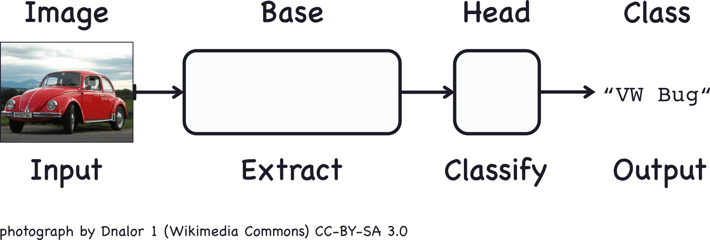
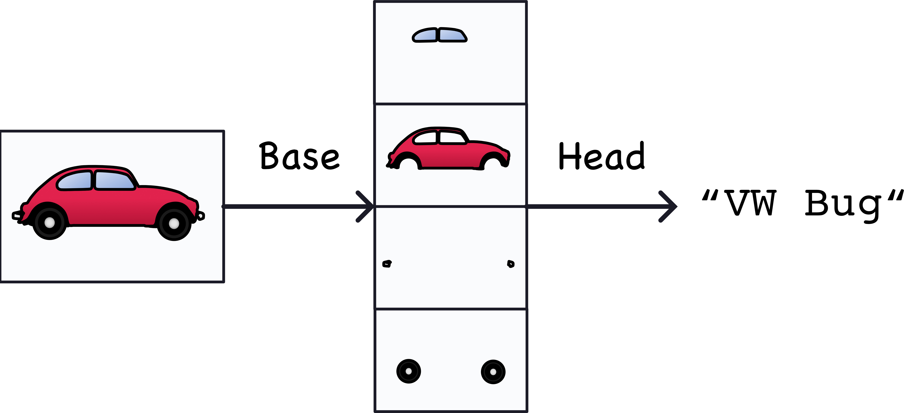
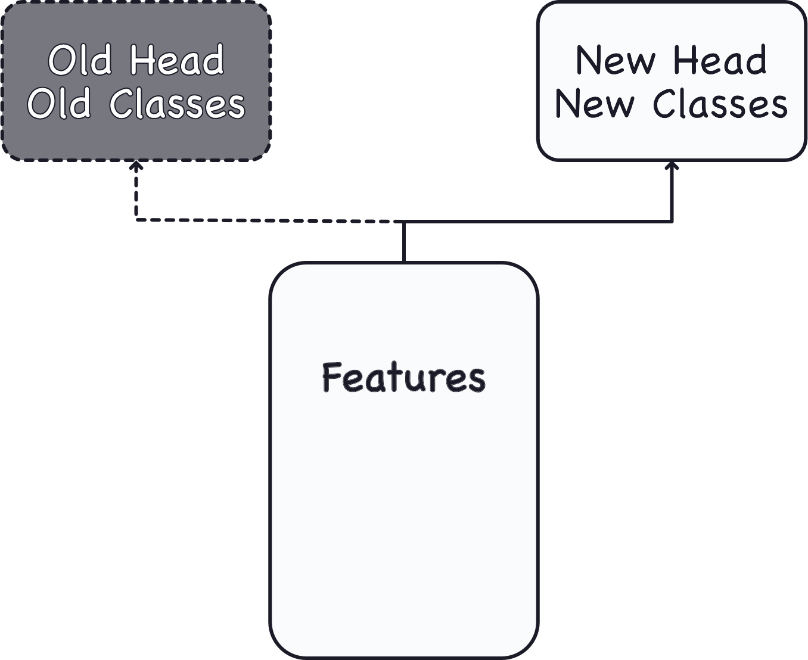
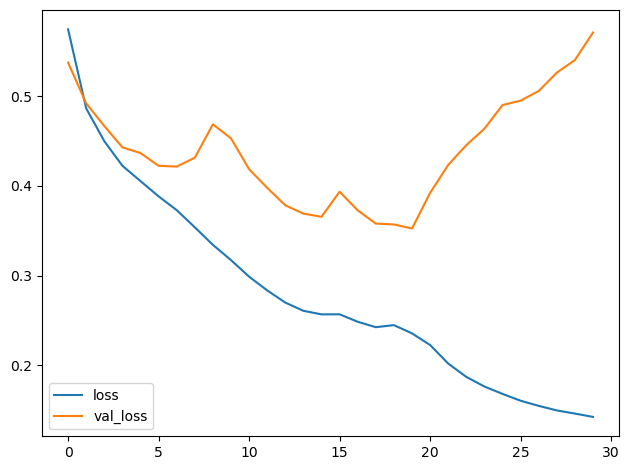
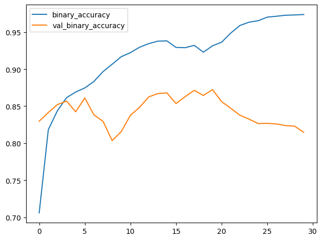

# 컨볼루션 분류기

# 컴퓨터 비전 강좌에 오신 것을 환영합니다!

컴퓨터가 ‘보는’ 법을 가르쳐 보고 싶었던 적이 있으신가요? 이 강좌에서 바로 그 일을 해보게 될 것입니다!

이 강좌에서는 다음을 배우게 됩니다:

최신 딥러닝 네트워크를 활용해 Keras로 이미지 분류기를 구축하기
재사용 가능한 블록을 활용해 나만의 맞춤형 컨볼루션 신경망(ConvNet)을 설계합니다
시각적 특징 추출의 기본 개념을 배웁니다
모델 성능을 향상시키는 전이 학습(Transfer Learning) 기술을 숙달합니다
데이터 증강(Data Augmentation)을 활용해 데이터셋을 확장합니다

‘딥러닝 입문’ 과정을 수강하셨다면, 이 과정을 성공적으로 이수하는 데 필요한 모든 지식을 갖추고 계실 것입니다.

그럼 시작해 봅시다!

# 소개

이 강좌에서는 컴퓨터 비전의 기본 개념을 소개합니다. 우리의 목표는 신경망이 자연 이미지를 충분히 '이해'하여 인간의 시각 시스템이 해결할 수 있는 것과 같은 종류의 문제를 해결할 수 있는 방법을 배우는 것입니다.

이 작업에 가장 뛰어난 신경망을 컨볼루션 신경망(Convolutional Neural Networks)이라고 합니다(때로는 convnet 또는 CNN이라고도 합니다). 컨볼루션은 컨볼루션 신경망의 각 층에 고유한 구조를 부여하는 수학적 연산입니다. 향후 강의에서 이 구조가 컴퓨터 비전 문제를 해결하는 데 왜 그렇게 효과적인지 배우게 될 것입니다.

우리는 이러한 개념을 이미지 분류 문제에 적용해 볼 것입니다. 즉, 주어진 사진이 무엇을 담고 있는지 컴퓨터가 알아낼 수 있도록 훈련시킬 수 있을까요? 사진을 보고 식물 종을 식별해 주는 앱을 본 적이 있을 것입니다. 바로 그것이 이미지 분류기입니다! 이 강좌에서는 전문적인 애플리케이션에서 사용되는 것만큼 강력한 이미지 분류기를 구축하는 방법을 배우게 될 것입니다.

이 강좌는 이미지 분류에 중점을 두지만, 여기서 배우는 내용은 모든 종류의 컴퓨터 비전 문제에 적용될 수 있습니다. 강좌를 마치면 생성적 적대 신경망(GAN)이나 이미지 분할과 같은 더 고급 응용 분야로 나아갈 준비가 될 것입니다.

# 컨볼루션 분류기

이미지 분류에 사용되는 컨볼루션 신경망(Convolutional Neural Network, Convolutional Net)은 컨볼루션 베이스와 덴스 헤드, 두 부분으로 구성됩니다.



베이스는 이미지에서 특징을 추출하는 데 사용됩니다. 주로 컨볼루션 연산을 수행하는 레이어로 구성되지만, 종종 다른 종류의 레이어도 포함됩니다. (이에 대해서는 다음 강의에서 배우게 될 것입니다.)

헤드는 이미지의 클래스를 결정하는 데 사용됩니다. 주로 밀집 레이어로 구성되지만, 드롭아웃(dropout)과 같은 다른 레이어가 포함될 수도 있습니다.

시각적 특징이란 무엇을 의미할까요? 특징은 선, 색상, 질감, 모양, 패턴이 될 수도 있고, 이들의 복잡한 조합일 수도 있습니다.

전체 과정은 대략 다음과 같습니다:



실제로 추출된 특징은 조금 다르게 보이지만, 대략적인 개념은 전달해 줍니다.

# 분류기 훈련

훈련 중 네트워크의 목표는 다음 두 가지를 학습하는 것입니다:

이미지에서 어떤 특징을 추출할지(베이스),
어떤 특징이 어떤 클래스에 해당하는지(헤드).

요즘에는 컨볼루션 신경망(ConvNets)을 처음부터 훈련시키는 경우는 거의 없습니다. 대부분 사전 훈련된 모델의 베이스 부분을 재사용합니다. 그런 다음 사전 훈련된 베이스에 훈련되지 않은 헤드를 연결합니다. 다시 말해, 1. 특징을 추출하는 방법을 이미 학습한 네트워크의 부분을 재사용하고, 여기에 2. 분류를 학습할 새로운 레이어를 추가하는 것입니다.



헤드는 보통 몇 개의 밀집 레이어로만 구성되기 때문에, 비교적 적은 데이터로도 매우 정확한 분류기를 만들 수 있습니다.

사전 훈련된 모델을 재사용하는 기법을 전이 학습(transfer learning)이라고 합니다. 이 기법은 매우 효과적이어서, 요즘 거의 모든 이미지 분류기가 이를 활용하고 있습니다.

# 예제 - 컨볼루션 신경망(Convnet) 분류기 훈련

이 강좌를 통해 우리는 다음과 같은 문제를 해결하려는 분류기를 만들 것입니다: 이 사진은 자동차인가, 트럭인가? 
우리의 데이터셋은 다양한 자동차 사진 약 10,000장으로, 약 절반은 자동차이고 나머지 절반은 트럭입니다.

## 1단계 - 데이터 불러오기

다음 숨겨진 셀에서는 몇 가지 라이브러리를 불러오고 데이터 파이프라인을 설정할 것입니다. ds_train이라는 훈련용 분할과 ds_valid라는 검증용 분할이 있습니다.

```python
# 임포트
import os, warnings
import matplotlib.pyplot as plt
from matplotlib import gridspec

import numpy as np
import tensorflow as tf
from tensorflow.keras.preprocessing import image_dataset_from_directory

# 재현성
def set_seed(seed=31415):
    np.random.seed(seed)
    tf.random.set_seed(seed)
    os.environ[‘PYTHONHASHSEED’] = str(seed)
    os.environ[‘TF_DETERMINISTIC_OPS’] = ‘1’
set_seed(31415)

# Matplotlib 기본값 설정
plt.rc(‘figure’, autolayout=True)
plt.rc(‘axes’, labelweight=‘bold’, labelsize=‘large’,
       titleweight=‘bold’, titlesize=18, titlepad=10)
plt.rc(‘image’, cmap=‘magma’)
warnings.filterwarnings(“ignore”) # 출력 셀 정리용

# 훈련 및 검증 데이터셋 불러오기
ds_train_ = image_dataset_from_directory(
    ‘../input/car-or-truck/train’,
    labels=‘inferred’,
    label_mode=‘binary’,
    image_size=[128, 128],
    interpolation=‘nearest’,
    batch_size=64,
    shuffle=True,
)
ds_valid_ = image_dataset_from_directory(
    ‘../input/car-or-truck/valid’,
    labels=‘inferred’,
    label_mode=‘binary’,
    image_size=[128, 128],
    interpolation=‘nearest’,
    batch_size=64,
    shuffle=False,
)

# 데이터 파이프라인
def convert_to_float(image, label):
    image = tf.image.convert_image_dtype(image, dtype=tf.float32)
    return image, label

AUTOTUNE = tf.data.experimental.AUTOTUNE
ds_train = (
    ds_train_
    .map (convert_to_float)
    .cache()
    .prefetch(buffer_size=AUTOTUNE)
)
ds_valid = (
    ds_valid_
    .map(convert_to_float)
    .cache()
    .prefetch(buffer_size=AUTOTUNE)
)
```

```python
2개 클래스에 속하는 5117개의 파일을 찾았습니다.
2개 클래스에 속하는 5051개의 파일을 찾았습니다.
```

훈련 데이터 세트의 몇 가지 예시를 살펴보겠습니다.

```python
import matplotlib.pyplot as plt
```

## 2단계 - 사전 학습된 기본 모델 정의

사전 학습에 가장 흔히 사용되는 데이터셋은 다양한 종류의 자연 이미지를 포함하는 대규모 데이터셋인 ImageNet입니다. Keras는 애플리케이션 모듈에 ImageNet으로 사전 학습된 다양한 모델을 포함하고 있습니다. 우리가 사용할 사전 학습된 모델은 VGG16입니다.

```python
pretrained_base = tf.keras.models.load_model(
    ‘../input/cv-course-models/cv-course-models/vgg16-pretrained-base’,
)
pretrained_base.trainable = False
```

## 3단계 - 헤드 연결

다음으로 분류기 헤드를 연결합니다. 이 예제에서는 숨겨진 유닛 레이어(첫 번째 Dense 레이어)를 사용하고, 그 뒤에 출력을 클래스 1(트럭)에 대한 확률 점수로 변환하는 레이어를 추가합니다. Flatten 레이어는 베이스의 2차원 출력을 헤드가 필요로 하는 1차원 입력으로 변환합니다.

```python
from tensorflow import keras
from tensorflow.keras import layers

model = keras.Sequential([
    pretrained_base,
    layers.Flatten(),
    layers.Dense(6, activation=‘relu’),
    layers.Dense(1, activation=‘sigmoid’),
])
```

## 4단계 - 훈련

마지막으로 모델을 훈련해 봅시다. 이 문제는 2-클래스 분류 문제이므로, 이진 크로스엔트로피와 이진 정확도를 사용할 것입니다. Adam 최적화기는 일반적으로 성능이 우수하므로, 이 최적화기도 선택하겠습니다.

```python
model.compile(
    optimizer=‘adam’,
    loss=‘binary_crossentropy’,
    metrics=[‘binary_accuracy’],
)

history = model.fit(
    ds_train,
    validation_data=ds_valid,
    epochs=30,
    verbose=0,
)
```

신경망을 훈련할 때는 항상 손실 및 메트릭 플롯을 확인하는 것이 좋습니다. history 객체는 이 정보를 history.history 사전 내에 포함하고 있습니다. Pandas를 사용하여 이 사전을 데이터프레임으로 변환하고 내장 메서드를 통해 플롯할 수 있습니다.

```python
import pandas as pd

history_frame = pd.DataFrame(history.history)
history_frame.loc[:, [‘loss’, ‘val_loss’]].plot()
history_frame.loc[:, [‘binary_accuracy’, ‘val_binary_accuracy’]].plot();
```





# 결론

이번 강의에서는 컨볼루션 신경망(ConvNet) 분류기의 구조에 대해 배웠습니다. 즉, 특징 추출을 수행하는 베이스(base) 위에 분류기 역할을 하는 헤드(head)가 위치하는 구조입니다.

헤드는 본질적으로 입문 과정에서 배운 것과 같은 일반적인 분류기입니다. 특징의 경우, 베이스에서 추출한 특징을 사용합니다. 이것이 바로 컨볼루션 분류기의 기본 개념입니다. 즉, 분류기 자체에 특징 공학(feature engineering)을 수행하는 유닛을 연결할 수 있다는 것입니다.

이는 딥 신경망이 기존 머신러닝 모델에 비해 갖는 큰 장점 중 하나입니다. 적절한 네트워크 구조가 주어지면, 딥 신경망은 문제를 해결하는 데 필요한 특징을 어떻게 설계할지 스스로 학습할 수 있습니다.

다음 몇 강의에서는 컨볼루션 베이스가 어떻게 특징 추출을 수행하는지 살펴보겠습니다. 그 후, 여러분은 이러한 아이디어를 적용하여 자신만의 분류기를 설계하는 방법을 배우게 될 것입니다.

# 여러분 차례

지금은 연습 문제로 넘어가서 나만의 이미지 분류기를 만들어 보세요!

질문이나 의견이 있으신가요? 코스 토론 포럼을 방문하여 다른 학습자들과 이야기를 나눠보세요.
