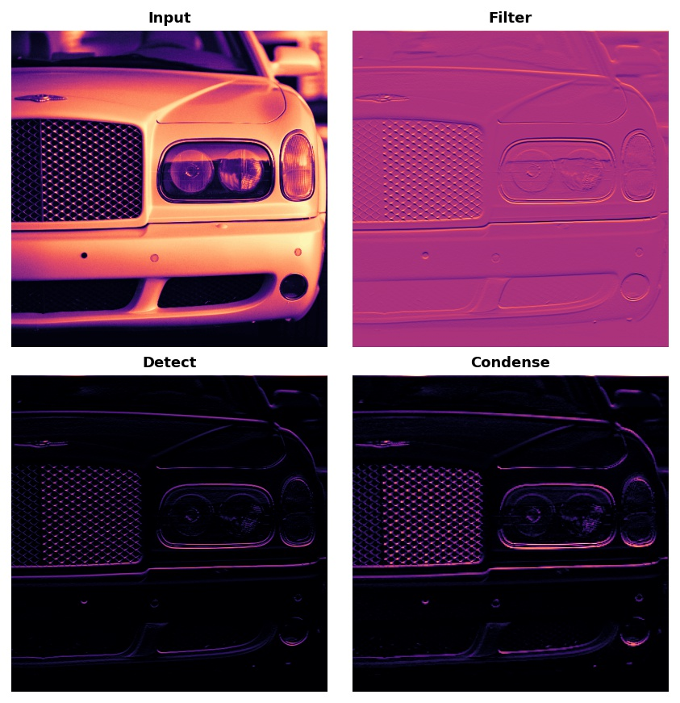
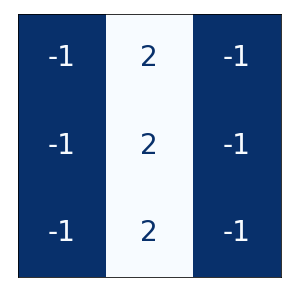
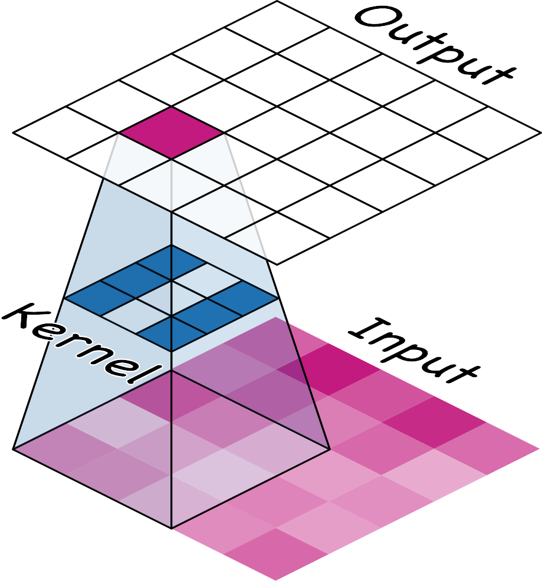
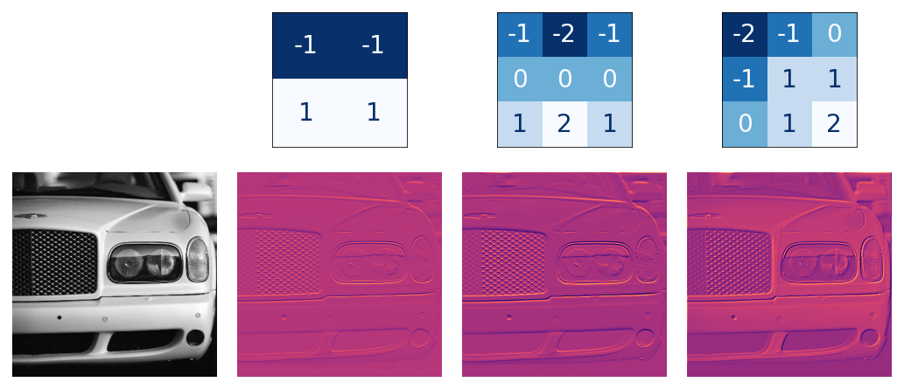
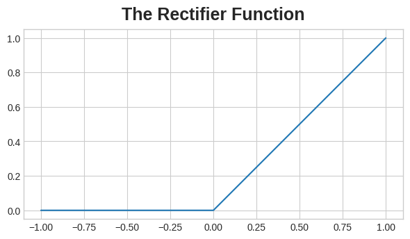
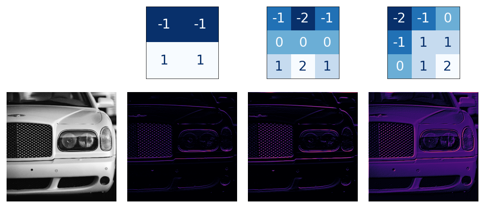
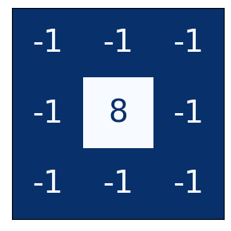
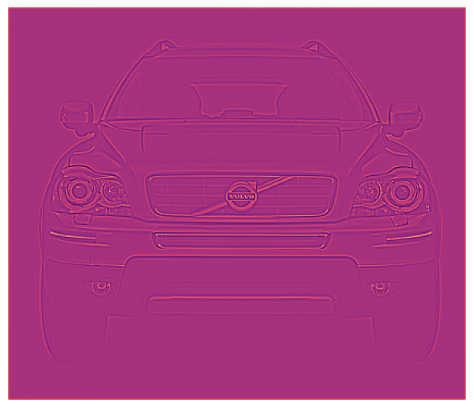
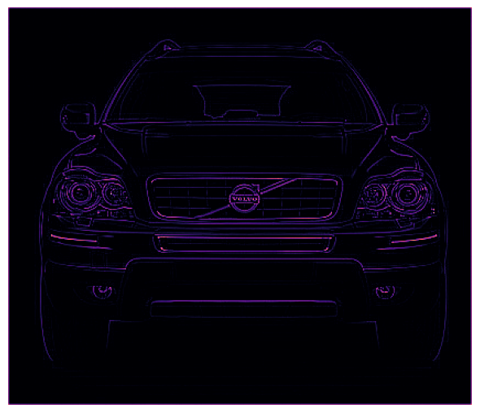

# 컨볼루션과 ReLU

```python
import numpy as np
from itertools import product

def show_kernel(kernel, label=True, digits=None, text_size=28):
    # 커널 형식 지정
    kernel = np.array(kernel)
    if digits is not None:
        kernel = kernel.round(digits)
    
    # 커널 플롯
    cmap = plt.get_cmap(‘Blues_r’)
    plt.imshow(kernel, cmap=cmap)
    rows, cols = kernel.shape
    thresh = (kernel.max()+kernel.min())/2
    # 선택적으로 값 레이블 추가
    
    if label:
        for i, j in product(range(rows), range(cols)):
            val = kernel[i, j]
            color = cmap(0) if val > thresh else cmap(255)
            plt.text(j, i, val, 
                     color=color, size=text_size,
                     horizontalalignment=’center’, verticalalignment=’center’)
    
    plt.xticks([])
    plt.yticks([])
```

# 소개

지난 강의에서 우리는 컨볼루션 분류기가 컨볼루션 베이스와 밀집 레이어 헤드로 구성된 두 부분으로 이루어져 있음을 살펴보았습니다. 베이스의 역할은 이미지에서 시각적 특징을 추출하는 것이며, 헤드는 이를 사용하여 이미지를 분류한다는 것을 배웠습니다.

다음 몇 강의에서는 컨볼루션 이미지 분류기의 베이스에서 흔히 볼 수 있는 가장 중요한 두 가지 유형의 레이어에 대해 배워보겠습니다. 바로 ReLU 활성화 함수를 사용하는 *컨볼루션 레이어*와 맥시멈 풀링 레이어입니다. 제5강에서는 이러한 레이어를 특징 추출을 수행하는 블록으로 조합하여 자신만의 컨볼루션 신경망(convnet)을 설계하는 방법을 배우게 될 것입니다.

이번 강의에서는 ReLU 활성화 함수를 사용하는 컨볼루션 레이어에 대해 다룹니다.

# 특징 추출

컨볼루션의 세부 내용으로 들어가기 전에, 네트워크 내에서 이러한 레이어의 목적을 먼저 살펴보겠습니다. 컨볼루션, ReLU, 최대 풀링이라는 세 가지 연산이 특징 추출 과정을 구현하는 데 어떻게 사용되는지 알아보겠습니다.

베이스에서 수행하는 특징 추출은 다음 세 가지 기본 연산으로 구성됩니다:

특정 특징을 찾아 이미지를 필터링(컨볼루션)
필터링된 이미지 내에서 해당 특징을 탐지(ReLU)
특징을 강화하기 위해 이미지를 압축(최대 풀링)

다음 그림은 이 과정을 보여줍니다. 이 세 가지 연산이 원본 이미지의 특정 특성(이 경우 수평선)을 어떻게 분리해내는지 확인할 수 있습니다.



일반적으로 네트워크는 단일 이미지에 대해 여러 추출 작업을 병렬로 수행합니다. 최신 컨볼루션 신경망(ConvNet)에서는 베이스의 최종 레이어가 1,000개 이상의 고유한 시각적 특징을 생성하는 경우도 드물지 않습니다.

# 컨볼루션으로 필터링

컨볼루션 레이어는 필터링 단계를 수행합니다. Keras 모델에서 컨볼루션 레이어를 다음과 같이 정의할 수 있습니다:

```python
from tensorflow import keras
from tensorflow.keras import layers

model = keras.Sequential([
    layers.Conv2D(filters=64, kernel_size=3), # 활성화 함수는 None
    # 더 많은 레이어가 이어짐
])
```

이 매개변수들은 레이어의 가중치 및 활성화 함수와의 관계를 살펴보면 이해할 수 있습니다. 지금 바로 살펴보겠습니다.

## 가중치

컨볼루션 신경망(convnet)이 훈련 중에 학습하는 가중치는 주로 컨볼루션 레이어에 포함됩니다. 이러한 가중치를 커널이라고 부릅니다. 이를 작은 배열로 표현할 수 있습니다:



커널은 이미지를 스캔하며 픽셀 값의 가중 합계를 산출하는 방식으로 작동합니다. 이러한 방식으로 커널은 일종의 편광 렌즈처럼 작용하여 특정 정보 패턴을 강조하거나 약화시킵니다.



커널은 컨볼루션 레이어가 다음 레이어와 어떻게 연결되는지를 정의합니다. 위의 커널은 출력의 각 뉴런을 입력의 9개 뉴런에 연결합니다. kernel_size를 사용하여 커널의 차원을 설정함으로써, 컨볼루션 신경망(convnet)에 이러한 연결을 형성하는 방법을 지시하게 됩니다. 대부분의 경우 커널은 kernel_size=(3, 3)이나 (5, 5)와 같이 차원이 홀수인 형태를 띠며, 이는 단일 픽셀이 중심에 위치하도록 하기 위함이지만, 이는 필수 조건은 아닙니다.

```python
kernel_size=(3, 3)
```

```python
(5, 5)
```

컨볼루션 레이어의 커널은 어떤 종류의 특징을 생성할지 결정합니다. 훈련 과정에서 컨볼루션 신경망은 분류 문제를 해결하는 데 필요한 특징을 학습하려고 시도합니다. 이는 커널에 대한 최적의 값을 찾는 것을 의미합니다.

## 활성화 함수

네트워크 내의 활성화 함수를 특징 맵이라고 부릅니다. 이는 이미지에 필터를 적용했을 때 얻어지는 결과물로, 커널이 추출한 시각적 특징을 담고 있습니다. 다음은 몇 가지 커널과 이들이 생성한 특징 맵의 예시입니다.



커널의 숫자 패턴을 보면, 해당 커널이 생성하는 특징 맵의 종류를 알 수 있습니다. 일반적으로 컨볼루션이 입력에서 강조하는 부분은 커널 내 양수 값의 모양과 일치합니다. 위의 왼쪽과 가운데 커널은 모두 수평적인 모양을 필터링할 것입니다.

filters 매개변수를 사용하여 컨볼루션 레이어가 출력으로 생성할 특징 맵의 개수를 지정합니다.

# ReLU를 이용한 감지

필터링 후, 특징 맵은 활성화 함수를 통과합니다. ReLU(Rectified Linear Unit) 함수의 그래프는 다음과 같습니다:



ReLU는 정류된 선형 유닛(Rectified Linear Unit)의 약자이며, 이 함수를 사용하는 뉴런을 ReLU 유닛이라고 합니다. 이 함수를 ReLU 활성화 함수 또는 ReLU 함수라고 부릅니다.

ReLU 활성화 함수는 별도의 Activation 레이어에서 정의할 수 있지만, 대부분은 Conv2D의 활성화 함수로 포함시킵니다.

```python
model = keras.Sequential([
    layers.Conv2D(filters=64, kernel_size=3, activation=‘relu’)
    # 더 많은 레이어가 이어집니다
])
```

활성화 함수는 중요도의 척도에 따라 픽셀 값에 점수를 매기는 것으로 생각할 수 있습니다. ReLU 활성화 함수는 음수 값은 중요하지 않다고 간주하여 이를 0으로 설정합니다. (“중요하지 않은 것은 모두 똑같이 중요하지 않다.”)

다음은 위의 특징 맵에 ReLU를 적용한 결과입니다. 특징을 얼마나 효과적으로 분리해내는지 확인해 보세요.



다른 활성화 함수와 마찬가지로 ReLU 함수는 비선형적입니다. 본질적으로 이는 네트워크 내 모든 레이어의 총 효과가 단순히 각 효과를 더했을 때 얻는 결과와 달라진다는 것을 의미합니다. 후자의 경우 단일 레이어만으로 달성할 수 있는 결과와 동일할 것입니다. 이러한 비선형성은 특징들이 네트워크 깊숙이 들어갈수록 흥미로운 방식으로 결합되도록 보장합니다. (이 “특징 복합화”에 대해서는 5강에서 더 자세히 살펴보겠습니다.)

# 예제 - 컨볼루션 및 ReLU 적용

이 예제에서는 컨볼루션 네트워크가 “배후에서” 무엇을 하는지 더 잘 이해하기 위해 특징 추출을 직접 수행해 보겠습니다.

이 예제에 사용할 이미지는 다음과 같습니다:

```python
import tensorflow as tf
import matplotlib.pyplot as plt
plt.rc(‘figure’, autolayout=True)
plt.rc(‘axes’, labelweight=‘bold’, labelsize=‘large’,
       titleweight=‘bold’, titlesize=18, titlepad=10)
plt.rc(‘image’, cmap=‘magma’)

image_path = ‘../input/computer-vision-resources/car_feature.jpg’
image = tf.io.read_file (image_path)
image = tf.io.decode_jpeg(image)

plt.figure(figsize=(6, 6))
plt.imshow(tf.squeeze(image), cmap=‘gray’)
plt.axis(‘off’)
plt.show();
```


필터링 단계에서는 커널을 정의한 다음, 이를 컨볼루션에 적용할 것입니다. 이 경우의 커널은 “에지 감지” 커널입니다. Numpy에서 np.array를 사용하여 배열을 정의하는 것과 마찬가지로 tf.constant를 사용하여 정의할 수 있습니다. 이렇게 하면 TensorFlow에서 사용하는 종류의 텐서가 생성됩니다.

```python
import tensorflow as tf

kernel = tf.constant([
    [-1, -1, -1],
    [-1, 8, -1],
    [-1, -1, -1],
])

plt.figure(figsize=(3, 3))
show_kernel (kernel)
```



TensorFlow는 tf.nn 모듈에 신경망에서 수행되는 많은 일반적인 연산을 포함하고 있습니다. 우리가 사용할 두 가지는 conv2d와 relu입니다. 이들은 단순히 Keras 레이어의 함수 버전입니다.

다음 숨겨진 셀은 TensorFlow와 호환되도록 형식을 약간 변경합니다. 이 예제에서는 세부 사항은 중요하지 않습니다.

```python
# 배치 호환성을 위해 재포맷합니다.
image = tf.image.convert_image_dtype(image, dtype=tf.float32)
image = tf.expand_dims(image, axis=0)
kernel = tf.reshape(kernel, [*kernel.shape, 1, 1])
kernel = tf.cast(kernel, dtype=tf.float32)
```

이제 커널을 적용해 보고 결과가 어떻게 나오는지 확인해 봅시다.

```python
image_filter = tf.nn.conv2d(
    input=image,
    filters=kernel,
    # 이 두 가지에 대해서는 4강에서 다룰 예정입니다!
    strides=1,
    padding=’SAME’,
)

plt.figure(figsize=(6, 6))
plt.imshow(tf.squeeze(image_filter))
plt.axis(‘off’)
plt.show();
```



다음은 ReLU 함수를 사용한 탐지 단계입니다. 이 함수는 설정해야 할 매개변수가 없기 때문에 컨볼루션보다 훨씬 간단합니다.

```python
image_detect = tf.nn.relu(image_filter)

plt.figure(figsize=(6, 6))
plt.imshow(tf.squeeze(image_detect))
plt.axis(‘off’)
plt.show();
```



이제 특징 맵을 생성했습니다! 이러한 이미지는 헤드(head)가 분류 문제를 해결하는 데 사용하는 자료입니다. 특정 특징은 자동차(Cars)에 더 특징적일 수 있고, 다른 특징은 트럭(Trucks)에 더 특징적일 수 있다고 상상해 볼 수 있습니다. 훈련 중 컨볼루션 신경망(convnet)의 임무는 이러한 특징을 찾아낼 수 있는 커널을 생성하는 것입니다.

# 결론

이번 강의에서는 컨볼루션 신경망이 특징 추출을 수행하는 데 사용하는 첫 두 단계, 즉 Conv2D 레이어를 통한 필터링과 ReLU 활성화 함수를 통한 탐지를 살펴보았습니다.

# 실습 시간

실습 과제에서는 1강에서 사용했던 사전 학습된 VGG16 모델의 커널을 직접 실험해 볼 기회가 있습니다.

질문이나 의견이 있으신가요? 코스 토론 포럼을 방문하여 다른 학습자들과 이야기를 나눠보세요.
