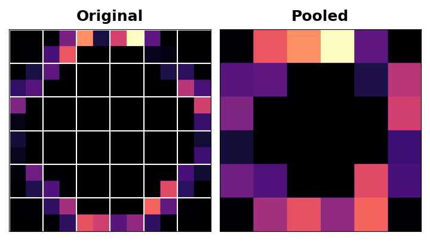
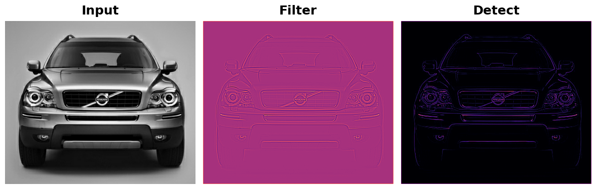
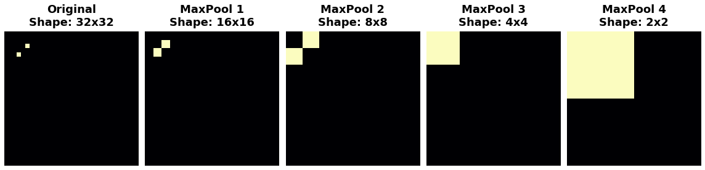
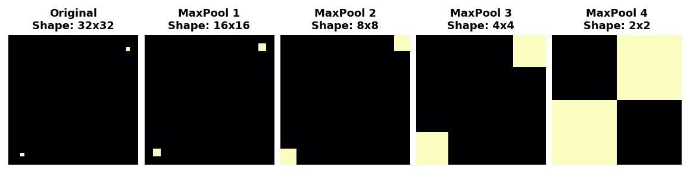

# 최대 풀링

# 소개

제2강에서는 컨볼루션 신경망(ConvNet)의 베이스(base)가 어떻게 특징 추출을 수행하는지에 대한 논의를 시작했습니다. 이 과정에서 처음 두 연산이 ReLU 활성화 함수를 사용하는 Conv2D 레이어에서 어떻게 이루어지는지 배웠습니다.

이번 강의에서는 이 순서의 세 번째(그리고 마지막) 연산인 **최대 풀링**을 통한 압축을 살펴보겠습니다. Keras에서는 MaxPool2D 레이어를 사용하여 이를 수행합니다.

# 최대 풀링을 통한 압축

앞서 살펴본 모델에 압축 단계를 추가하면 다음과 같이 됩니다:

```python
from tensorflow import keras
from tensorflow.keras import layers

model = keras.Sequential([
    layers.Conv2D(filters=64, kernel_size=3), # 활성화 함수는 None
    layers.MaxPool2D(pool_size=2),
    # 더 많은 레이어가 이어집니다
])
```

MaxPool2D 레이어는 Conv2D 레이어와 매우 유사하지만, 커널 대신 간단한 최대값 함수를 사용하며, pool_size 매개변수는 kernel_size와 유사합니다. 하지만 MaxPool2D 레이어에는 컨볼루션 레이어의 커널에 있는 것과 같은 훈련 가능한 가중치가 없습니다.

지난 강의의 특징 추출 그림을 다시 한 번 살펴보겠습니다. MaxPool2D가 바로 Condense 단계임을 기억하십시오.


ReLU 함수(Detect)를 적용한 후, 특징 맵에는 많은 “사각지대”, 즉 0만 포함된 넓은 영역(이미지의 검은색 영역)이 남게 된다는 점에 주목하세요. 이러한 0 값의 활성화 값을 네트워크 전체에 걸쳐 전달해야 한다면, 유용한 정보를 크게 추가하지도 못한 채 모델의 크기가 커지게 됩니다. 대신, 특징 맵을 압축하여 가장 유용한 부분, 즉 특징 자체만 남기고 싶습니다.

사실 이것이 바로 맥시멈 풀링이 하는 일입니다. 맥시멈 풀링은 원본 특징 맵의 활성화 값 패치를 가져와, 해당 패치 내 최대 활성화 값으로 대체합니다.



ReLU 활성화 후 적용하면 특징을 “강화”하는 효과가 있습니다. 풀링 단계는 활성 픽셀이 0인 픽셀에 비해 차지하는 비율을 높여줍니다.

# 예제 - 맥시멈 풀링 적용

레슨 2의 예제에서 수행한 특징 추출 과정에 “압축” 단계를 추가해 봅시다. 다음 숨겨진 셀은 우리가 중단했던 지점으로 돌아가게 해줄 것입니다.

```python
import tensorflow as tf
import matplotlib.pyplot as plt
import warnings

plt.rc(‘figure’, autolayout=True)
plt.rc(‘axes’, labelweight=‘bold’, labelsize=‘large’,
       titleweight=‘bold’, titlesize=18, titlepad=10)
plt.rc(‘image’, cmap=‘magma’)
warnings.filterwarnings(“ignore”) # 출력 셀을 정리하기 위해

# 이미지 읽기
image_path = ‘../input/computer-vision-resources/car_feature.jpg’
image = tf.io.read_file(image_path)
image = tf.io.decode_jpeg(image)

# 커널 정의
kernel = tf.constant([
    [-1, -1, -1],
    [-1, 8, -1],
    [-1, -1, -1],
], dtype=tf.float32)

# 배치 호환성을 위해 형식을 변환합니다.
image = tf.image.convert_image_dtype(image, dtype=tf.float32)
image = tf.expand_dims(image, axis=0)
kernel = tf.reshape(kernel, [*kernel.shape, 1, 1])

# 필터링 단계
image_filter = tf.nn.conv2d(
    input=image,
    filters=kernel,
    # 이 두 가지에 대해서는 다음 강의에서 다룰 예정입니다!
    strides=1,
    padding=‘SAME’
)

# 탐지 단계
image_detect = tf.nn.relu(image_filter)

# 지금까지의 결과 표시
plt.figure(figsize=(12, 6))
plt.subplot(131)
plt.imshow(tf.squeeze(image), cmap=‘gray’)
plt.axis(‘off’)
plt.title(‘Input’)
plt.subplot (132)
plt.imshow(tf.squeeze(image_filter))
plt.axis(‘off’)
plt.title(‘Filter’)
plt.subplot(133)
plt.imshow(tf.squeeze(image_detect))
plt.axis(‘off’)
plt.title(‘Detect’)
plt.show();
```



풀링 단계를 적용하기 위해 tf.nn의 또 다른 함수인 tf.nn.pool을 사용할 것입니다. 이 함수는 모델 구축 시 사용하는 MaxPool2D 레이어와 동일한 기능을 수행하지만, 간단한 함수이기 때문에 직접 사용하기 더 쉽습니다.

```python
import tensorflow as tf

image_condense = tf.nn.pool(
    input=image_detect, # 위 Detect 단계의 이미지
    window_shape=(2, 2),
    pooling_type=‘MAX’,
    # 다음 강의에서 이들이 어떤 역할을 하는지 살펴보겠습니다!
    
strides=(2, 2),
    padding=‘SAME’,
)

plt.figure(figsize=(6, 6))
plt.imshow(tf.squeeze(image_condense))
plt.axis(‘off’)
plt.show();
```


꽤 멋지네요! 풀링 단계가 가장 활성도가 높은 픽셀 주변의 이미지를 압축함으로써 특징을 어떻게 강화했는지 확인하셨기를 바랍니다.

# 평행 이동 불변성

우리는 0값 픽셀을 “중요하지 않은” 것으로 불렀습니다. 그렇다면 이 픽셀들은 정보를 전혀 담고 있지 않다는 뜻일까요? 사실, 0값 픽셀은 위치 정보를 담고 있습니다. 빈 공간은 여전히 이미지 내에서 특징의 위치를 지정합니다. MaxPool2D가 이러한 픽셀 중 일부를 제거하면, 특징 맵의 위치 정보 일부도 제거됩니다. 이는 컨볼루션 신경망(convnet)에 '이동 불변성(translation invariance)'이라는 특성을 부여합니다. 즉, 맥시멈 풀링을 사용하는 컨볼루션 신경망은 이미지 내 위치에 따라 특징을 구분하지 않는 경향이 있습니다. (“이동(Translation)”은 회전하거나 모양이나 크기를 변경하지 않고 무언가의 위치를 바꾸는 것을 의미하는 수학적 용어입니다.)

다음 특징 맵에 맥시멈 풀링을 반복적으로 적용하면 어떤 일이 일어나는지 살펴봅시다.



반복적인 풀링 후 원본 이미지의 두 점은 구별할 수 없게 되었습니다. 즉, 풀링이 두 점의 위치 정보 일부를 제거한 것입니다. 네트워크가 더 이상 특징 맵에서 두 점을 구별할 수 없게 되었으므로, 원본 이미지에서도 구별할 수 없게 되었습니다. 즉, 위치 차이에 대해 불변성을 갖게 된 것입니다.

사실 풀링은 이미지 속 두 점의 경우처럼, 네트워크 내에서 짧은 거리 내에서만 평행 이동 불변성을 생성합니다. 멀리 떨어져 있는 특징들은 풀링 후에도 여전히 구별됩니다; 위치 정보 중 일부만 손실되었을 뿐, 전부는 아닙니다.



특징 위치의 미세한 차이에 대한 이러한 불변성은 이미지 분류기가 갖춰야 할 훌륭한 특성입니다. 시점이나 구도의 차이 때문에 동일한 종류의 특징이 원본 이미지의 여러 곳에 위치할 수 있지만, 우리는 분류기가 그것들이 동일하다는 것을 인식하기를 원합니다. 이러한 불변성이 네트워크에 내장되어 있기 때문에, 훈련에 훨씬 적은 양의 데이터만으로도 충분합니다. 더 이상 그 차이를 무시하도록 학습시킬 필요가 없기 때문입니다. 이는 밀집층만 있는 네트워크에 비해 컨볼루션 네트워크에 큰 효율성 이점을 제공합니다. (데이터 증강을 다루는 6강에서 불변성을 자연스럽게 얻는 또 다른 방법을 보게 될 것입니다!)

# 결론

이번 강의에서는 특징 추출의 마지막 단계인 MaxPool2D를 이용한 압축에 대해 배웠습니다. 4강에서는 슬라이딩 윈도우를 활용한 컨볼루션과 풀링에 대한 논의를 마무리할 예정입니다.

# 여러분 차례

이제 연습 문제를 시작하여 2강에서 시작한 특징 추출을 마무리하고, 이 불변성 특성이 실제로 어떻게 작용하는지 확인해 보세요. 또한 또 다른 종류의 풀링인 평균 풀링에 대해서도 배워보시기 바랍니다!

질문이나 의견이 있으신가요? 코스 토론 포럼을 방문하여 다른 수강생들과 이야기를 나눠보세요.
