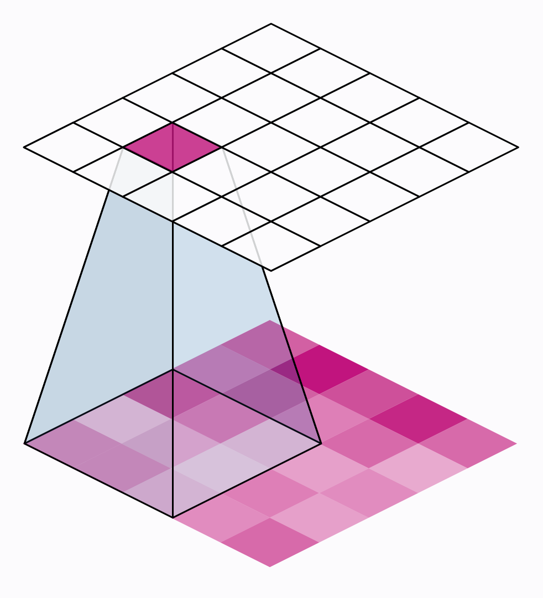
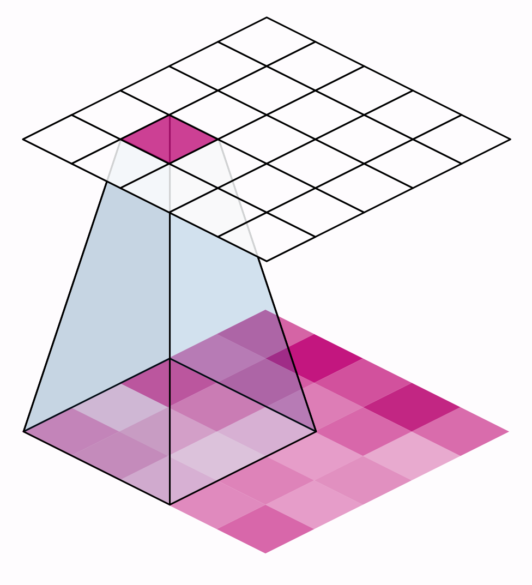
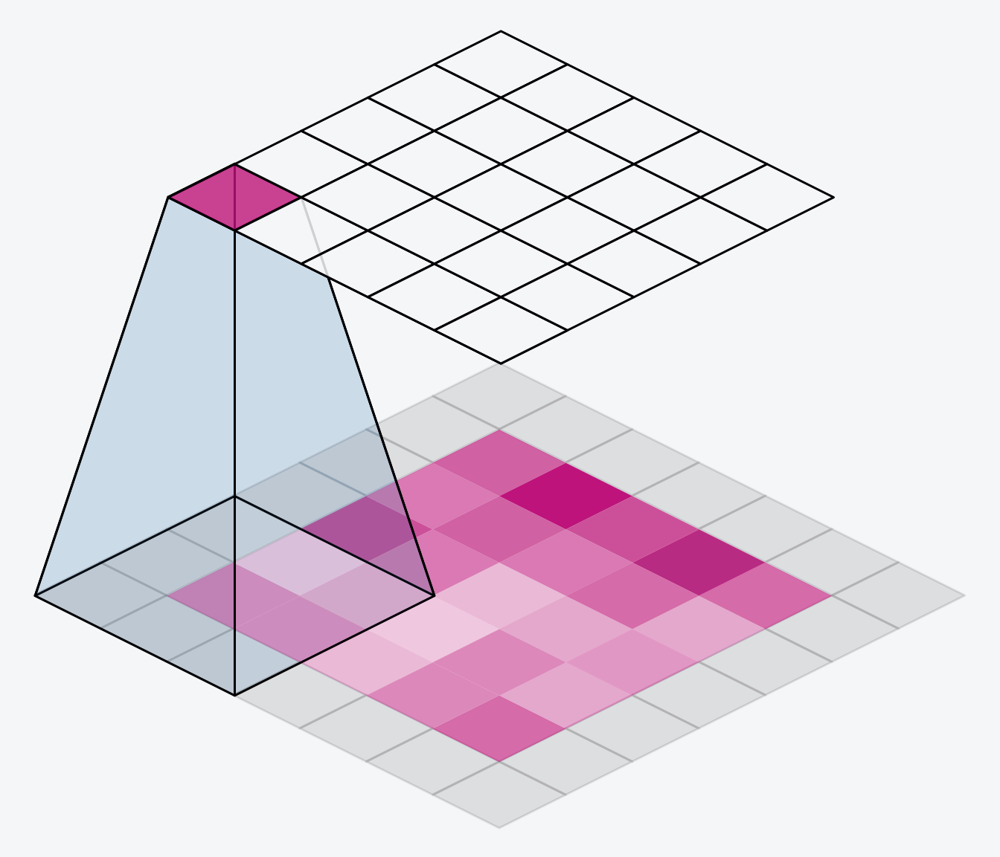
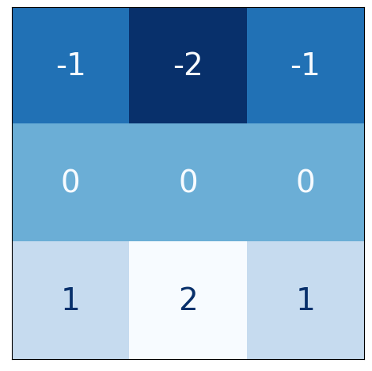
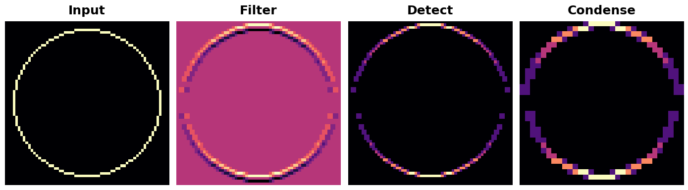
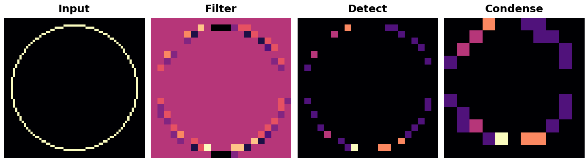

# 슬라이딩 윈도우

```python
import numpy as np
from itertools import product
from skimage import draw, transform

def circle(size, val=None, r_shrink=0):
    circle = np.zeros([size[0]+1, size[1]+1])
    
    rr, cc = draw.circle_perimeter(
        size[0]//2, size[1]//2,
        radius=size[0]//2 - r_shrink,
        shape=[size[0]+1, size[1]+1],
    )
    if val is None:
        circle[rr, cc] = np.random.uniform(size=circle.shape)[rr, cc]
    else:
        circle[rr, cc] = val
    circle = transform.resize(circle, size, order=0)
    return circle

def show_kernel(kernel, label=True, digits=None, text_size=28):
    # 커널 형식 지정
    kernel = np.array(kernel)
    if digits is not None:
        kernel = kernel.round(digits)

    # 커널 플롯
    cmap = plt.get_cmap(‘Blues_r’)
    plt.imshow(kernel, cmap=cmap)
    
    rows, cols = kernel.shape
    thresh = (kernel.max()+kernel.min())/2
    # 선택적으로 값 레이블 추가
    if label:
        for i, j in product(range(rows), range(cols)):
            val = kernel[i, j]
            color = cmap(0) if val > thresh else cmap(255)
            
            plt.text(j, i, val, 
                     color=color, size=text_size,
                     horizontalalignment=’center’, verticalalignment=’center’)
    plt.xticks([])
    plt.yticks([])

def show_extraction(image,
                    kernel,
                    conv_stride=1,
                    conv_padding=’valid’,
                    activation=’relu’,
                    pool_size=2,
                    pool_stride=2,
                    pool_padding=’same’,
                    figsize=(10, 10),
                    subplot_shape=(2, 2),
                    ops=[‘Input’, ‘Filter’, ‘Detect’, ‘Condense’],
                    gamma=1.0):
    # 레이어 생성
    model = tf.keras.Sequential([
                    tf.keras.layers.Conv2D(
                        filters=1,
                        kernel_size=kernel.shape,
                        strides=conv_stride,
                        padding=conv_padding,
                        use_bias=False,
                        input_shape=image.shape,
                    ),
                    tf.keras.layers.Activation(activation),
                    tf.keras.layers.MaxPool2D(
                        pool_size=pool_size,
                        strides=pool_stride,
                        padding=pool_padding,
                    ),
                   ])
    
    layer_filter, layer_detect, layer_condense = model.layers
    kernel = tf.reshape(kernel, [*kernel.shape, 1, 1])
    layer_filter.set_weights([kernel])
    
    # TF용 형식
    image = tf.expand_dims(image, axis=0)
    image = tf.image.convert_image_dtype(image, dtype=tf.float32) 
    
    # 특징 추출
    image_filter = layer_filter(image)
    image_detect = layer_detect(image_filter)
    image_condense = layer_condense(image_detect)
    
    images = {}
    if ‘Input’ in ops:
        images.update({‘Input’: (image, 1.0)})
    if ‘Filter’ in ops:
        images.update({‘Filter’: (image_filter, 1.0)})
    if ‘Detect’ in ops:
        images.update({‘Detect’: (image_detect, gamma)})
    if ‘Condense’ in ops:
        images.update({‘Condense’: (image_condense, gamma)})
    
    # 플롯
    plt.figure(figsize=figsize)
    for i, title in enumerate(ops):
        image, gamma = images[title]
        plt.subplot(*subplot_shape, i+1)
        plt.imshow(tf.image.adjust_gamma(tf.squeeze(image), gamma))
        plt.axis(‘off’)
        plt.title(title)
```

# 소개

지난 두 강의에서 우리는 이미지에서 특징 추출을 수행하는 세 가지 연산에 대해 배웠습니다:

컨볼루션 레이어를 사용한 필터링
ReLU 활성화 함수를 사용한 검출
맥시멈 풀링 레이어를 사용한 압축

컨볼루션과 풀링 연산은 공통된 특징을 가지고 있습니다. 둘 다 슬라이딩 윈도우를 통해 수행된다는 점입니다. 컨볼루션의 경우, 이 “윈도우”는 커널의 차원, 즉 kernel_size 매개변수로 주어집니다. 풀링의 경우, 이는 pool_size로 지정되는 풀링 윈도우입니다.



컨볼루션 레이어와 풀링 레이어 모두에 영향을 미치는 두 가지 추가 매개변수가 있습니다. 바로 윈도우의 스트라이드(stride)와 이미지 가장자리에서 패딩을 사용할지 여부입니다. strides 매개변수는 윈도우가 각 단계에서 얼마나 이동해야 하는지를 나타내며, padding 매개변수는 입력 이미지의 가장자리에 있는 픽셀을 어떻게 처리할지를 설명합니다.

이 두 매개변수를 사용하여 두 레이어를 정의하면 다음과 같습니다:

```python
from tensorflow import keras
from tensorflow.keras import layers

model = keras.Sequential([
    layers.Conv2D(filters=64,
                  kernel_size=3,
                  strides=1,
                  padding=‘same’,
                  activation=‘relu’),
    
layers.MaxPool2D(pool_size=2,
                     strides=1,
                     padding=‘same’)
    # 더 많은 레이어가 이어집니다
])
```

# 스트라이드

각 단계에서 윈도우가 이동하는 거리를 스트라이드라고 합니다. 이미지의 두 차원 모두에 대해 스트라이드를 지정해야 합니다: 하나는 좌우 이동용이고, 다른 하나는 상하 이동용입니다. 이 애니메이션은 strides=(2, 2), 즉 매 단계마다 2픽셀씩 이동하는 모습을 보여줍니다.

```python
strides=(2, 2)
```



스트라이드는 어떤 영향을 미칠까요? 어느 한 방향의 스트라이드가 1보다 클 때마다, 슬라이딩 윈도우는 매 단계마다 입력 이미지의 일부 픽셀을 건너뛰게 됩니다.

분류를 위해 고품질의 특징을 얻고자 하므로, 컨볼루션 레이어의 스트라이드는 대부분 strides=(1, 1)로 설정됩니다. 스트라이드를 늘리면 요약 과정에서 잠재적으로 유용한 정보를 놓치게 됩니다. 반면, 맥시멈 풀링 레이어의 스트라이드 값은 거의 항상 (2, 2)나 (3, 3)처럼 1보다 크지만, 윈도우 자체보다 크지는 않습니다.

```python
strides=(1, 1)
```

```python
(2, 2)
```

```python
(3, 3)
```

마지막으로, 스트라이드 값이 양방향 모두 동일한 숫자인 경우 해당 숫자만 설정하면 됩니다. 예를 들어, strides=(2, 2) 대신 매개변수 설정 시 strides=2를 사용할 수 있습니다.

```python
strides=(2, 2)
```

```python
strides=2
```

# 패딩

슬라이딩 윈도우 연산을 수행할 때, 입력 이미지의 경계에서 어떻게 처리할지에 대한 문제가 발생합니다. 입력 이미지 내부에만 머무르게 되면, 윈도우가 입력 이미지의 다른 모든 픽셀에 대해 그러하듯이 경계 픽셀 위에 정확히 위치하지 않게 됩니다. 모든 픽셀을 정확히 동일하게 처리하지 않는다면 문제가 발생할 수 있을까요?

컨볼루션이 이러한 경계 값을 어떻게 처리할지는 패딩(padding) 매개변수에 의해 결정됩니다. TensorFlow에서는 padding=‘same’ 또는 padding=‘valid’ 중 하나를 선택할 수 있습니다. 각각의 선택에는 장단점이 있습니다.

```python
padding=‘same’
```

```python
padding=‘valid’
```

padding='valid'로 설정하면 컨볼루션 윈도우가 입력 영역 내에 완전히 머무르게 됩니다. 단점은 출력이 축소(픽셀 손실)된다는 점이며, 커널이 클수록 더 많이 축소됩니다. 이는 특히 입력 크기가 작을 때 네트워크가 포함할 수 있는 레이어 수를 제한하게 됩니다.

```python
padding=‘valid’
```

대안은 padding=‘same'을 사용하는 것입니다. 여기서 핵심은 입력 이미지의 가장자리를 0으로 채워서, 출력 크기가 입력 크기와 동일해지도록 하는 것입니다. 하지만 이 방법은 가장자리 픽셀의 영향력을 희석시키는 결과를 초래할 수 있습니다. 아래 애니메이션은 'same’ 패딩을 적용한 슬라이딩 윈도우를 보여줍니다.

```python
padding=‘same’
```

```python
‘same’
```



지금까지 살펴본 VGG 모델은 모든 컨볼루션 레이어에 ‘same’ 패딩을 사용합니다. 대부분의 최신 컨볼루션 신경망은 이 두 가지 방식을 조합하여 사용합니다. (조정해야 할 또 다른 매개변수!)

# 예제 - 슬라이딩 윈도우 탐구

슬라이딩 윈도우 매개변수의 효과를 더 잘 이해하려면, 개별 픽셀을 확인할 수 있도록 저해상도 이미지에 대한 특징 추출 과정을 관찰하는 것이 도움이 됩니다. 간단한 원 하나를 살펴보겠습니다.

다음 숨겨진 셀은 이미지와 커널을 생성해 줄 것입니다.

```python
import tensorflow as tf
import matplotlib.pyplot as plt

plt.rc(‘figure’, autolayout=True)
plt.rc(‘axes’, labelweight=‘bold’, labelsize=‘large’,
       titleweight=‘bold’, titlesize=18, titlepad=10)
plt.rc(‘image’, cmap=‘magma’)

image = circle([64, 64], val=1.0, r_shrink=3)
image = tf.reshape(image, [*image.shape, 1])
# 하단 소벨
kernel = tf.constant(
    [[-1, -2, -1],
     [0, 0, 0],
     [1, 2, 1]],
)

show_kernel(kernel)
```



VGG 아키텍처는 상당히 간단합니다. 스트라이드 1의 컨볼루션과 2×2 윈도우 및 스트라이드 2의 맥시멈 풀링을 사용합니다. visiontools 유틸리티 스크립트에 모든 단계를 보여주는 함수를 포함시켰습니다.

```python
show_extraction(
    image, kernel,

    # 윈도우 매개변수
    conv_stride=1,
    pool_size=2,
    pool_stride=2,

    subplot_shape=(1, 4),
    figsize=(14, 6),
)
```



그리고 꽤 잘 작동합니다! 커널은 수평선을 탐지하도록 설계되었으며, 결과 특징 맵에서 입력 이미지의 수평적인 부분이 가장 큰 활성화 값을 보이는 것을 확인할 수 있습니다.

컨볼루션의 스트라이드를 3으로 변경하면 어떻게 될까요?

```python
show_extraction(
    image, kernel,

    # 윈도우 매개변수
    conv_stride=3,
    pool_size=2,
    pool_stride=2,

    subplot_shape=(1, 4),
    figsize=(14, 6), 
)
```



이렇게 하면 추출된 특징의 품질이 떨어지는 것으로 보입니다. 입력 원은 너비가 1픽셀에 불과해 상당히 “세밀한” 구조를 가지고 있습니다. 스트라이드가 3인 컨볼루션은 너무 거칠어서 이를 통해 양질의 특징 맵을 생성하기 어렵습니다.

때로는 모델이 초기 레이어에서 더 큰 스트라이드를 가진 컨볼루션을 사용하기도 합니다. 이는 대개 더 큰 커널과 함께 사용됩니다. 예를 들어, ResNet50 모델은 첫 번째 레이어에서 스트라이드 2의 7×7 커널을 사용합니다. 이는 입력의 정보를 너무 많이 희생하지 않으면서도 대규모 특징 생성을 가속화하는 것으로 보입니다.

# 결론

이번 강의에서는 컨볼루션과 풀링 모두에 공통적으로 적용되는 계산 방식인 슬라이딩 윈도우와, 이 레이어에서 그 동작에 영향을 미치는 매개변수들을 살펴보았습니다. 이러한 윈도우 기반 계산 방식은 컨볼루션 네트워크의 특징을 형성하는 데 크게 기여하며, 네트워크 작동의 필수적인 부분입니다.

# 실습

연습 문제로 넘어가서 슬라이딩 윈도우를 탐구하고, 컨볼루션 레이어를 쌓아 올림으로써 유효 윈도우 크기를 늘리는 방법을 배우며, 시계열과 같은 1차원 데이터에 컨볼루션을 적용하는 방법도 알아보세요.

질문이나 의견이 있으신가요? 코스 토론 포럼을 방문하여 다른 학습자들과 이야기를 나눠보세요.
