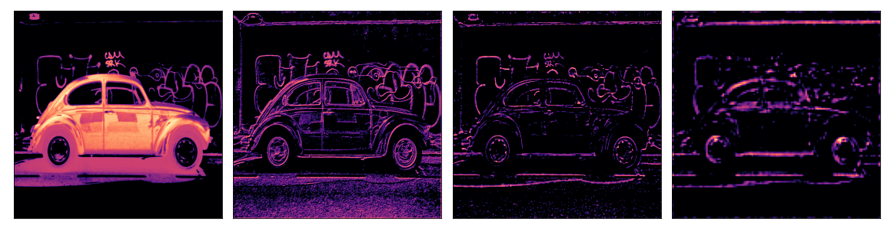
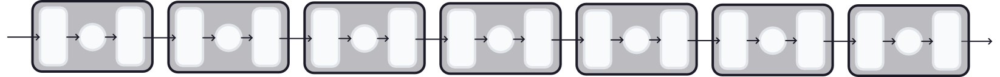
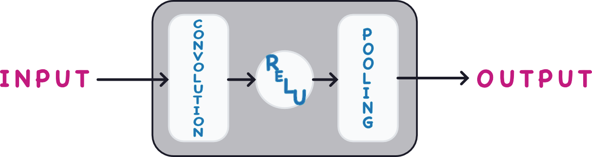
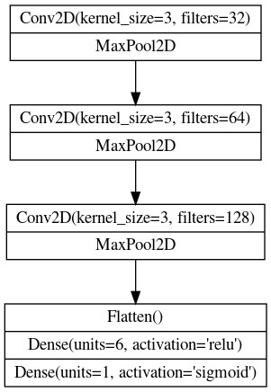
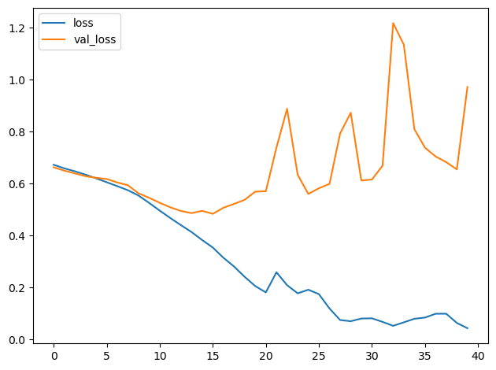
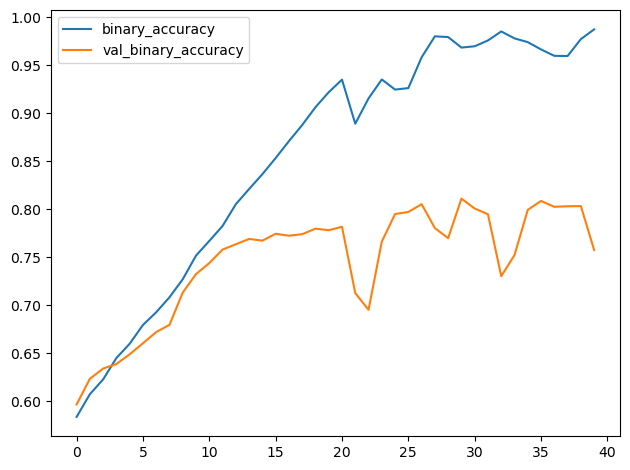

# 사용자 정의 컨볼루션 신경망

# 소개

컨볼루션 신경망이 특징을 추출하는 데 사용하는 레이어들을 살펴보았으니, 이제 이를 조합하여 나만의 네트워크를 구축해 볼 차례입니다!

# 단순함에서 정교함으로

지난 세 강의에서 우리는 컨볼루션 신경망이 필터링(filter), 탐지(detect), 압축(condense)이라는 세 가지 연산을 통해 특징 추출을 수행하는 방식을 살펴보았습니다. 단 한 번의 특징 추출 과정으로는 이미지에서 단순한 선이나 명암 대비와 같은 비교적 단순한 특징만 추출할 수 있습니다. 이러한 특징만으로는 대부분의 분류 문제를 해결하기에는 너무 단순합니다. 대신, 컨볼루션 신경망은 이 추출 과정을 반복하여 특징이 네트워크 깊숙이 들어갈수록 더 복잡하고 정교해지도록 합니다.



# 컨볼루션 블록

이는 특징 추출을 수행하는 긴 컨볼루션 블록 체인을 통해 특징을 전달함으로써 이루어집니다.



이러한 컨볼루션 블록은 Conv2D 및 MaxPool2D 레이어의 중첩 구조로, 지난 몇 강의에서 특징 추출에서의 역할을 배웠습니다.



각 블록은 한 번의 특징 추출 단계를 나타내며, 이러한 블록들을 조합함으로써 컨볼루션 신경망은 생성된 특징들을 결합하고 재조합하여, 해당 문제에 더 잘 맞도록 특징을 확장하고 형성할 수 있습니다. 현대 컨볼루션 신경망의 깊은 구조는 이러한 정교한 특징 공학을 가능하게 하며, 그 뛰어난 성능의 주된 원인이 되어 왔습니다.

# 예제 - 컨볼루션 신경망 설계

복잡한 특징을 생성할 수 있는 심층 컨볼루션 신경망을 정의하는 방법을 살펴보겠습니다. 이 예제에서는 Keras 시퀀스 모델을 생성한 다음, Cars 데이터셋을 사용하여 훈련할 것입니다.

## 1단계 - 데이터 불러오기

이 숨겨진 셀은 데이터를 불러옵니다.

```python
# 임포트
import os, warnings
import matplotlib.pyplot as plt
from matplotlib import gridspec

import numpy as np
import tensorflow as tf
from tensorflow.keras.preprocessing import image_dataset_from_directory

# 재현성
def set_seed(seed=31415):
    np.random.seed(seed)
    tf.random.set_seed(seed)
    os.environ[‘PYTHONHASHSEED’] = str(seed)
    os.environ[‘TF_DETERMINISTIC_OPS’] = ‘1’
set_seed()

# Matplotlib 기본값 설정
plt.rc(‘figure’, autolayout=True)
plt.rc(‘axes’, labelweight=‘bold’, labelsize=‘large’,
       titleweight=‘bold’, titlesize=18, titlepad=10)
plt.rc(‘image’, cmap=‘magma’)
warnings.filterwarnings(“ignore”) # 출력 셀 정리용

# 훈련 및 검증 데이터셋 불러오기
ds_train_ = image_dataset_from_directory(
    ‘../input/car-or-truck/train’,
    labels=‘inferred’,
    label_mode=‘binary’,
    image_size=[128, 128],
    interpolation=‘nearest’,
    batch_size=64,
    shuffle=True,
)
ds_valid_ = image_dataset_from_directory(
    ‘../input/car-or-truck/valid’,
    labels=‘inferred’,
    label_mode=‘binary’,
    image_size=[128, 128],
    interpolation=‘nearest’,
    batch_size=64,
    shuffle=False,
)

# 데이터 파이프라인
def convert_to_float(image, label):
    image = tf.image.convert_image_dtype(image, dtype=tf.float32)
    return image, label

AUTOTUNE = tf.data.experimental.AUTOTUNE
ds_train = (
    ds_train_
    .map(convert_to_float)
    .cache()
    .prefetch(buffer_size=AUTOTUNE)
)
ds_valid = (
    ds_valid_
    .map(convert_to_float)
    .cache()
    .prefetch(buffer_size=AUTOTUNE)
)
```

```python
2개 클래스에 속하는 5117개의 파일을 찾았습니다.
2개 클래스에 속하는 5051개의 파일을 찾았습니다.
```

## 2단계 - 모델 정의

다음은 우리가 사용할 모델의 다이어그램입니다:



이제 모델을 정의해 보겠습니다. 모델이 Conv2D 및 MaxPool2D 레이어(베이스) 3개 블록과 그 뒤에 이어지는 Dense 레이어 헤드로 구성되어 있음을 확인할 수 있습니다. 적절한 매개변수를 입력하기만 하면 이 다이어그램을 Keras Sequential 모델로 거의 그대로 변환할 수 있습니다.

```python
from tensorflow import keras
from tensorflow.keras import layers

model = keras.Sequential([

    # 첫 번째 컨볼루션 블록
    layers.Conv2D(filters=32, kernel_size=5, activation="relu", padding=’same’,
                  # 첫 번째 레이어의 입력 차원을 지정합니다
                  # [높이, 너비, 색상 채널(RGB)]
                  input_shape=[128, 128, 3]),
    layers.MaxPool2D(),

    # 두 번째 컨볼루션 블록
    layers.Conv2D(filters=64, kernel_size=3, activation="relu", padding=’same’),
    layers.MaxPool2D(),
    
    # 세 번째 컨볼루션 블록
    layers.Conv2D(filters=128, kernel_size=3, activation="relu", padding=’same’),
    layers.MaxPool2D(),
    
    # 분류기 헤드
    layers.Flatten(),
    layers.Dense(units=6, activation="relu"),
    layers.Dense(units=1, activation="sigmoid"),
])
model.summary()
```

```python
모델: “sequential”
_________________________________________________________________
 
레이어 (유형) 출력 형상 매개변수 수 # 
=================================================================
 conv2d (Conv2D) (None, 128, 128, 32) 2432 
                                                                 
 max_pooling2d (MaxPooling2D (None, 64, 64, 32) 0 
 )
                                                                   
conv2d_1 (Conv2D) (None, 64, 64, 64) 18496 
                                                                 
 max_pooling2d_1 (MaxPooling (None, 32, 32, 64) 0
  
2D) 
                                                                 
 conv2d_2 (Conv2D) (None, 32, 32, 128) 73856 
                                                                 
 max_pooling2d_2 (MaxPooling (None, 16, 16, 128) 0
  
2D) 
                                                                 
 flatten (Flatten) (None, 32768) 0 
                                                                 
 dense (Dense) (None, 6) 196614 
                                                                 
 dense_1 (Dense) (None, 1) 7
                                                                  
=================================================================
총 매개변수: 291,405
훈련 가능 매개변수: 291,405
훈련 불가능 매개변수: 0
_________________________________________________________________
```

이 정의에서 주목할 점은 필터 수가 블록마다 두 배로 증가했다는 것입니다: 32, 64, 128. 이는 흔한 패턴입니다. MaxPool2D 레이어가 특징 맵의 크기를 줄여주기 때문에, 생성하는 필터의 수를 늘릴 수 있습니다.

## 3단계 - 훈련

이 모델은 레슨 1의 모델과 마찬가지로 훈련할 수 있습니다. 이진 분류에 적합한 손실 함수와 메트릭을 사용하여 최적화기와 함께 컴파일하면 됩니다.

```python
model.compile(
    optimizer=tf.keras.optimizers.Adam(epsilon=0.01),
    loss=‘binary_crossentropy’,
    metrics=[‘binary_accuracy’]
)

history = model.fit(
    ds_train,
    validation_data=ds_valid,
    epochs=40,
    verbose=0,
)
```

```python
import pandas as pd

history_frame = pd.DataFrame(history.history)
history_frame.loc[:, [‘loss’, ‘val_loss’]].plot()
history_frame.loc[:, [‘binary_accuracy’, ‘val_binary_accuracy’]].plot();
```





이 모델은 1강에서 다룬 VGG16 모델보다 훨씬 작습니다. VGG16이 16개의 컨볼루션 레이어를 가진 반면, 이 모델은 단 3개의 레이어만 가지고 있습니다. 그럼에도 불구하고 이 데이터셋에 꽤 잘 맞췄습니다. 데이터셋에 더 잘 적응하는 특징을 생성하기 위해 컨볼루션 레이어를 더 추가함으로써 이 간단한 모델을 개선할 수 있을 것입니다. 이것이 바로 연습 문제에서 시도해 볼 내용입니다.

# 결론

이 튜토리얼에서는 여러 컨볼루션 블록으로 구성되어 복잡한 특징 공학이 가능한 맞춤형 컨볼루션 신경망(convnet)을 구축하는 방법을 살펴보았습니다.

# 실습 시간

실습에서는 사전 학습 없이도 이 문제에 대해 VGG16만큼 우수한 성능을 보이는 컨볼루션 신경망을 만들어 보겠습니다. 지금 바로 시작해 보세요!

질문이나 의견이 있으신가요? 코스 토론 포럼을 방문하여 다른 학습자들과 이야기를 나눠보세요.
