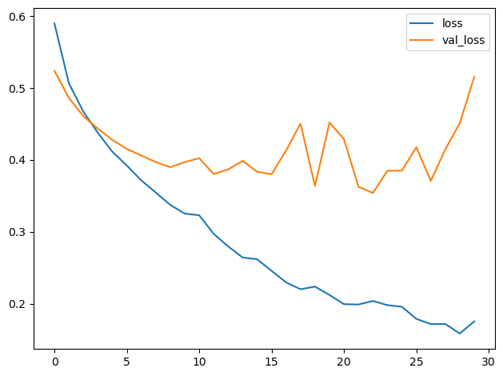
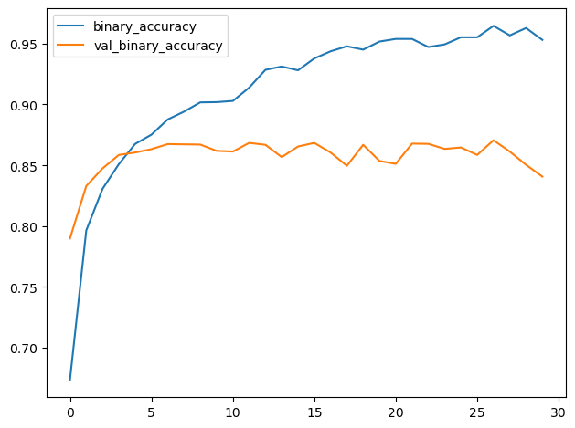

# 데이터 증강

# 소개

이제 컨볼루션 분류기의 기초를 배웠으니, 더 심화된 주제로 넘어갈 준비가 되었습니다.

이번 강의에서는 이미지 분류기의 성능을 한 단계 끌어올릴 수 있는 기술을 배워보겠습니다. 바로 ‘데이터 증강’입니다.

# 가짜 데이터의 유용성

머신러닝 모델의 성능을 향상시키는 가장 좋은 방법은 더 많은 데이터로 모델을 훈련시키는 것입니다. 모델이 학습할 예시가 많을수록, 이미지의 어떤 차이가 중요한지, 어떤 차이가 중요하지 않은지를 더 잘 인식할 수 있게 됩니다. 데이터가 많을수록 모델의 일반화 능력이 향상됩니다.

더 많은 데이터를 확보하는 쉬운 방법 중 하나는 이미 가지고 있는 데이터를 활용하는 것입니다. 데이터셋의 이미지를 클래스를 유지한 채로 변환할 수 있다면, 분류기가 그러한 변환을 무시하도록 훈련시킬 수 있습니다. 예를 들어, 사진 속 자동차가 왼쪽을 향하든 오른쪽을 향하든, 그것이 '트럭'이 아닌 '자동차'라는 사실은 변하지 않습니다. 따라서 훈련 데이터에 뒤집힌 이미지를 추가하면, 분류기는 “왼쪽 또는 오른쪽”이라는 차이를 무시해야 한다는 것을 학습하게 됩니다.

이것이 바로 데이터 증강의 핵심 개념입니다. 실제 데이터와 꽤 비슷해 보이는 가짜 데이터를 추가하면 분류기의 성능이 향상됩니다.

# 데이터 증강 활용

일반적으로 데이터셋을 증강할 때는 다양한 종류의 변환 기법이 사용됩니다. 여기에는 이미지 회전, 색상이나 대비 조정, 이미지 왜곡 등이 포함될 수 있으며, 보통 이러한 기법들이 조합되어 적용됩니다. 다음은 단일 이미지를 변환할 수 있는 다양한 방법의 예시입니다.


데이터 증강은 일반적으로 온라인으로 수행되는데, 이는 훈련을 위해 이미지가 네트워크로 입력되는 동안 이루어진다는 의미입니다. 훈련은 보통 미니 배치 단위의 데이터로 진행된다는 점을 상기해 보세요. 데이터 증강을 적용했을 때 16장의 이미지로 구성된 배치는 다음과 같이 보일 수 있습니다.


훈련 중에 이미지가 사용될 때마다 새로운 무작위 변환이 적용됩니다. 이렇게 하면 모델은 이전에 본 것과 약간 다른 것을 항상 보게 됩니다. 훈련 데이터에 추가된 이러한 변동성이 모델이 새로운 데이터를 처리하는 데 도움이 됩니다.

하지만 모든 변환이 주어진 문제에 유용한 것은 아니라는 점을 기억하는 것이 중요합니다. 무엇보다도, 어떤 변환을 사용하든 클래스를 혼동해서는 안 됩니다. 예를 들어 숫자 인식기를 훈련할 때 이미지를 회전하면 '9'와 '6'이 혼동될 수 있습니다. 결국, 좋은 데이터 증강 방법을 찾는 최선의 접근 방식은 대부분의 머신러닝 문제와 마찬가지로 '직접 시도해 보고 확인하는 것'입니다!

# 예제 - 데이터 증강을 활용한 훈련

Keras에서는 두 가지 방법으로 데이터를 증강할 수 있습니다. 첫 번째 방법은 ImageDataGenerator와 같은 함수를 사용하여 데이터 파이프라인에 포함시키는 것입니다. 두 번째 방법은 Keras의 전처리 레이어를 사용하여 모델 정의에 포함시키는 것입니다. 이번에는 이 두 번째 접근 방식을 사용할 것입니다. 이 방법의 가장 큰 장점은 이미지 변환 작업이 CPU가 아닌 GPU에서 수행되어 훈련 속도를 높일 수 있다는 점입니다.

이 연습에서는 데이터 증강을 통해 1강에서 배운 분류기를 개선하는 방법을 배웁니다. 다음 숨겨진 셀은 데이터 파이프라인을 설정합니다.

```python
# 임포트
import os, warnings
import matplotlib.pyplot as plt
from matplotlib import gridspec

import numpy as np
import tensorflow as tf
from tensorflow.keras.preprocessing import image_dataset_from_directory

# 재현성
def set_seed(seed=31415):
    np.random.seed(seed)
    tf.random.set_seed(seed)
    os.environ[‘PYTHONHASHSEED’] = str(seed)
    #os.environ[‘TF_DETERMINISTIC_OPS’] = ‘1’
set_seed()

# Matplotlib 기본값 설정
plt.rc(‘figure’, autolayout=True)
plt.rc(‘axes’, labelweight=‘bold’, labelsize=‘large’,
       titleweight=‘bold’, titlesize=18, titlepad=10)
plt.rc(‘image’, cmap=‘magma’)
warnings.filterwarnings(“ignore”) # 출력 셀 정리용

# 훈련 및 검증 데이터셋 불러오기
ds_train_ = image_dataset_from_directory(
    ‘../input/car-or-truck/train’,
    labels=‘inferred’,
    label_mode=‘binary’,
    image_size=[128, 128],
    interpolation=‘nearest’,
    batch_size=64,
    shuffle=True,
)
ds_valid_ = image_dataset_from_directory(
    ‘../input/car-or-truck/valid’,
    labels=‘inferred’,
    label_mode=‘binary’,
    image_size=[128, 128],
    interpolation=‘nearest’,
    batch_size=64,
    shuffle=False,
)

# 데이터 파이프라인
def convert_to_float(image, label):
    image = tf.image.convert_image_dtype(image, dtype=tf.float32)
    return image, label

AUTOTUNE = tf.data.experimental.AUTOTUNE
ds_train = (
    ds_train_
    .map(convert_to_float)
    .cache()
    .prefetch(buffer_size=AUTOTUNE)
)
ds_valid = (
    ds_valid_
    .map(convert_to_float)
    .cache()
    .prefetch(buffer_size=AUTOTUNE)
)
```

```python
2개 클래스에 속하는 5117개의 파일을 찾았습니다.
2개 클래스에 속하는 5051개의 파일을 찾았습니다.
```

## 2단계 - 모델 정의

데이터 증강(augmentation)의 효과를 보여주기 위해, 튜토리얼 1의 모델에 몇 가지 간단한 변환을 추가해 보겠습니다.

```python
from tensorflow import keras
from tensorflow.keras import layers
# 이는 TF 2.2의 새로운 기능입니다
from tensorflow.keras.layers.experimental import preprocessing

pretrained_base = tf.keras.models.load_model(
    ‘../input/cv-course-models/cv-course-models/vgg16-pretrained-base’,
)
pretrained_base.trainable = False

model = keras.Sequential([
    # 전처리
    preprocessing.RandomFlip(‘horizontal’), # 좌우 반전
    preprocessing.RandomContrast(0.5), # 대비를 최대 50%까지 변경
    
# 베이스
    pretrained_base,
    # 헤드
    layers.Flatten(),
    layers.Dense(6, activation=‘relu’),
    layers.Dense(1, activation=‘sigmoid’),
])
```

## 3단계 - 훈련 및 평가

이제 훈련을 시작해 보겠습니다!

```python
model.compile(
    optimizer=‘adam’,
    loss=‘binary_crossentropy’,
    metrics=[‘binary_accuracy’],
)

history = model.fit(
    ds_train,
    validation_data=ds_valid,
    epochs=30,
    verbose=0,
)
```

```python
import pandas as pd

history_frame = pd.DataFrame(history.history)

history_frame.loc[:, [‘loss’, ‘val_loss’]].plot()
history_frame.loc[:, [‘binary_accuracy’, ‘val_binary_accuracy’]].plot();
```





튜토리얼 1의 모델에서 훈련 곡선과 검증 곡선은 꽤 빨리 갈라졌는데, 이는 정규화가 도움이 될 수 있음을 시사합니다. 이 모델의 학습 곡선들은 서로 더 가깝게 유지될 수 있었으며, 검증 손실과 정확도에서 소폭의 개선을 달성했습니다. 이는 데이터셋이 실제로 데이터 증강으로부터 이득을 얻었음을 시사합니다.

# 여러분 차례

연습 문제로 넘어가서 레슨 5에서 구축한 사용자 정의 컨볼루션 신경망에 데이터 증강을 적용해 보세요. 이것이 여러분이 만든 최고의 모델이 될 것입니다!

질문이나 의견이 있으신가요? 코스 토론 포럼을 방문하여 다른 학습자들과 이야기를 나눠보세요.
