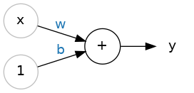
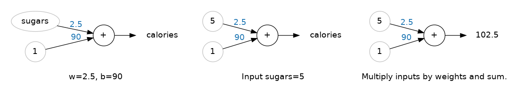
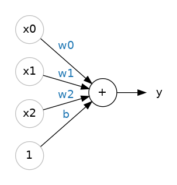

# 딥 러닝에 오신 것을 환영합니다!
Kaggle의 ‘딥 러닝 입문’ 과정에 오신 것을 환영합니다! 이제 여러분만의 딥 신경망을 구축하는 데 필요한 모든 것을 배우게 될 것입니다. Keras와 TensorFlow를 활용하여 다음을 배우게 됩니다:

- 완전 연결 신경망 아키텍처 구축하기
- 회귀와 분류라는 두 가지 대표적인 머신러닝 문제에 신경망 적용하기
- 확률적 경사 하강법을 사용하여 신경망 훈련하기
- 드롭아웃, 배치 정규화 및 기타 기법을 통해 성능 향상시키기

튜토리얼에서는 실제 예제를 통해 이러한 주제를 소개하고, 연습 문제에서는 주제를 더 깊이 있게 탐구하며 실제 데이터셋에 적용해 보게 됩니다.

그럼 시작해 봅시다!

## 딥 러닝이란 무엇인가?
최근 몇 년간 인공지능 분야에서 가장 인상적인 발전 중 일부는 딥 러닝 분야에서 이루어졌습니다. 자연어 번역, 이미지 인식, 게임 플레이 등은 모두 딥 러닝 모델이 인간 수준의 성능에 근접하거나 심지어 이를 뛰어넘은 과제들입니다.

그렇다면 딥 러닝이란 무엇일까요? 딥 러닝은 깊은 계산 계층을 특징으로 하는 기계 학습의 한 접근 방식입니다. 이러한 계산의 깊이가 바로 딥 러닝 모델이 가장 까다로운 실제 데이터 세트에서 발견되는 복잡하고 계층적인 패턴을 해독할 수 있게 해준 원동력입니다.

신경망은 그 성능과 확장성 덕분에 딥 러닝을 대표하는 모델이 되었습니다. 신경망은 뉴런으로 구성되어 있으며, 각 뉴런은 개별적으로 단순한 계산만 수행합니다. 신경망의 힘은 오히려 이러한 뉴런들이 형성할 수 있는 연결의 복잡성에서 비롯됩니다.

## 선형 유닛

그럼 신경망의 기본 구성 요소인 개별 뉴런부터 살펴보겠습니다. 도식적으로 보면, 입력 단자가 하나 있는 뉴런(또는 유닛)은 다음과 같습니다:



입력은 `x`입니다. 이 입력과 뉴런 사이의 연결에는 `w`라는 가중치가 있으며, 값이 연결을 통해 흐를 때마다 가중치가 곱해집니다. 따라서 뉴런에 도달하는 값은 `w * x`가 됩니다. 신경망은 바로 이 가중치를 수정함으로써 “학습”합니다.

`b`는 **편향(bias)**이라고 부르는 특별한 종류의 가중치입니다. 편향에는 연관된 입력 데이터가 없습니다. 대신, 다이어그램에 1을 표시하여 뉴런에 도달하는 값이 단순히 `b`가 되도록(`1 * b = b`) 합니다. 편향을 통해 뉴런은 입력과 무관하게 출력값을 조정할 수 있습니다.

`y`는 뉴런이 최종적으로 출력하는 값입니다. 뉴런은 연결을 통해 수신하는 모든 값을 합산하여 출력을 계산합니다. 따라서 이 뉴런의 출력은 다음과 같습니다:

> **y = w × x + b**

## 예시 - 모델로서의 선형 단위
개별 신경세포는 대개 더 큰 네트워크의 일부로만 기능하지만, 기준점으로 단일 신경세포 모델부터 시작하는 것이 종종 유용합니다. 단일 신경세포 모델은 선형 모델입니다.

'80 Cereals'와 같은 데이터셋에서 이것이 어떻게 작동할지 생각해 봅시다. ‘sugars’(1회 제공량당 당분 함량, 그램)를 입력으로, ‘calories’(1회 제공량당 칼로리)를 출력으로 하여 모델을 훈련하면, 편향(b)은 90, 가중치(w)는 2.5임을 알 수 있습니다. 1회 제공량당 당분 함량이 5그램인 시리얼의 칼로리 함량은 다음과 같이 추정할 수 있습니다:




## 다중 입력

‘80 Cereals’ 데이터셋에는 ‘당분’ 외에도 훨씬 더 많은 특징이 포함되어 있습니다. 식이섬유나 단백질 함량 같은 요소까지 모델에 포함시키고 싶다면 어떻게 해야 할까요? 방법은 간단합니다. 추가할 특징마다 뉴런에 입력 연결을 하나씩 추가하면 됩니다. 출력을 구할 때는 각 입력에 해당 가중치를 곱한 뒤 모두 더합니다.



입력이 여러 개일 때 공식은 다음과 같이 확장됩니다:

> **y = w₀×x₀ + w₁×x₁ + w₂×x₂ + b**

입력 변수가 두 개인 선형 유닛은 3차원 공간의 **평면**에 적합하며, 입력 변수가 더 많을 경우에는 **초평면hyperplane**에 적합합니다.

## Keras의 선형 모델
Keras에서 모델을 만드는 가장 쉬운 방법은 keras.Sequential을 사용하는 것으로, 이는 신경망을 레이어의 중첩 구조로 생성합니다. 우리는 밀집 레이어(다음 강의에서 더 자세히 다룰 예정입니다)를 사용하여 위와 같은 모델을 만들 수 있습니다.

다음과 같이 세 가지 입력 특징(‘sugars’, ‘fiber’, ‘protein’)을 받아 하나의 출력(‘calories’)을 생성하는 선형 모델을 정의할 수 있습니다:

```
from tensorflow import keras
from tensorflow.keras import layers

# Create a network with 1 linear unit
model = keras.Sequential([
    layers.Dense(units=1, input_shape=[3])
])
```

- `units`: 원하는 출력의 수를 정의합니다. 여기서는 ‘칼로리’ 하나만 예측하므로 `units=1`로 설정합니다.
- `input_shape`: Keras에 입력의 차원을 알려줍니다. `input_shape=[3]`으로 설정하면 모델이 세 가지 특징(‘당분’, ‘식이섬유’, ‘단백질’)을 입력으로 받습니다.

이제 이 모델을 훈련 데이터에 적용할 준비가 되었습니다!

### 왜 input_shape가 파이썬 리스트일까요?
이 강좌에서 사용할 데이터는 Pandas 데이터프레임과 같은 표 형식의 데이터입니다. 데이터셋의 각 특징(feature)마다 하나의 입력값이 있습니다. 특징들은 열 단위로 배열되어 있으므로, input_shape은 항상 [num_columns]이 됩니다. Keras가 여기서 리스트를 사용하는 이유는 더 복잡한 데이터셋을 사용할 수 있도록 하기 위해서입니다. 예를 들어, 이미지 데이터의 경우 [높이, 너비, 채널]과 같은 3차원 구조가 필요할 수 있습니다.
