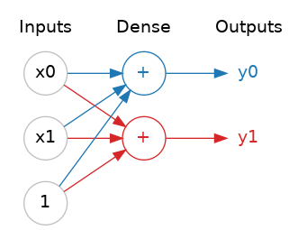
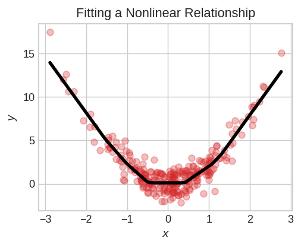
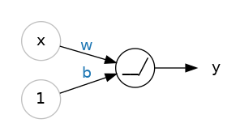
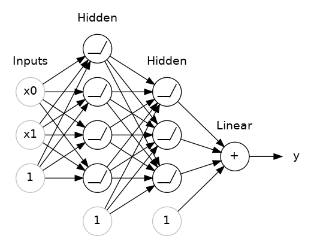

# 심층 신경망 (Deep Neural Networks)

## 소개
이번 강의에서는 딥 뉴럴 네트워크가 잘 알려진 복잡한 관계들을 학습할 수 있는 신경망을 어떻게 구축할 수 있는지 살펴보겠습니다.

여기서 핵심 개념은 모듈성입니다. 즉, 단순한 기능 단위들을 조합하여 복잡한 네트워크를 구축하는 것입니다. 지금까지 선형 유닛이 선형 함수를 어떻게 계산하는지 살펴보았습니다. 이제 이러한 개별 유닛들을 결합하고 수정하여 더 복잡한 관계를 모델링하는 방법을 알아보겠습니다.

## 층
신경망은 일반적으로 뉴런을 층으로 구성합니다. 공통된 입력 집합을 갖는 선형 유닛들을 모으면 밀집층이 됩니다.



### 다양한 종류의 레이어
Keras에서 “레이어”는 매우 포괄적인 개념입니다. 레이어는 본질적으로 어떤 형태의 데이터 변환이든 될 수 있습니다. 컨볼루션 레이어나 재귀 신경망 레이어와 같은 많은 레이어는 뉴런을 활용해 데이터를 변환하며, 주로 형성하는 연결 패턴에 따라 서로 다릅니다. 반면, 다른 레이어들은 특징 공학이나 단순한 산술 연산에 사용되기도 합니다. 탐구해 볼 만한 레이어의 세계가 무궁무진하니, 한번 살펴보세요!


## 활성화 함수
그러나 중간에 아무것도 없는 두 개의 밀집층은 밀집층 하나만 있는 경우보다 나을 것이 없다는 사실이 밝혀졌습니다. 밀집층만으로는 결코 선과 평면의 세계를 벗어날 수 없습니다. 우리에게 필요한 것은 비선형적인 요소입니다. 바로 활성화 함수가 필요합니다.



* 활성화 함수가 없다면, 신경망은 선형 관계만 학습할 수 있습니다. 곡선을 적합시키려면 활성화 함수를 사용해야 합니다.

활성화 함수란 단순히 각 레이어의 출력값(활성화 값)에 적용하는 함수를 말합니다. 가장 일반적인 것은 정류 함수인 `max(0, x)`입니다.


정류 함수의 그래프는 음의 부분이 0으로 “정류”된 직선입니다. 이 함수를 뉴런의 출력에 적용하면 데이터에 굴곡이 생겨 단순한 직선 형태에서 벗어나게 됩니다.

이 정류기를 선형 유닛에 적용하면 **정류 선형 유닛(ReLU)** 을 얻게 됩니다. ReLU 활성화 함수를 적용하면 출력은 `max(0, w * x + b)`가 되며, 이를 도식으로 나타내면 다음과 같습니다:



## 밀집 레이어 쌓기
이제 비선형성이 도입되었으니, 레이어를 어떻게 쌓아 복잡한 데이터 변환을 얻을 수 있는지 살펴보겠습니다.



* 촘촘하게 쌓인 층들이 모여 “전체 연결(fully-connected)” 신경망을 이룹니다.

출력층 앞의 층들은 그 출력을 직접 볼 수 없기 때문에 때때로 ‘숨겨진 층’이라고 불립니다.

이제, 마지막(출력) 층이 선형 유닛(즉, 활성화 함수가 없음)이라는 점에 주목하세요. 이 때문에 이 신경망은 임의의 수치 값을 예측하려는 회귀 작업에 적합합니다. 분류와 같은 다른 작업의 경우 출력에 활성화 함수가 필요할 수 있습니다.


## 순차적 모델 구축
지금까지 사용해 온 순차적 모델은 여러 레이어를 첫 번째부터 마지막까지 순서대로 연결합니다. 첫 번째 레이어가 입력을 받고, 마지막 레이어가 출력을 생성합니다. 이를 통해 위 그림과 같은 모델이 만들어집니다:

```
from tensorflow import keras
from tensorflow.keras import layers

model = keras.Sequential([
    # the hidden ReLU layers
    layers.Dense(units=4, activation='relu', input_shape=[2]),
    layers.Dense(units=3, activation='relu'),
    # the linear output layer 
    layers.Dense(units=1),
])
```

각 레이어를 별도의 인자로 전달하는 대신, `[레이어, 레이어, ...]` 형태의 리스트로 한꺼번에 전달해야 합니다. 레이어에 활성화 함수를 추가하려면 `activation` 인자에 함수 이름을 문자열로 지정하면 됩니다.
