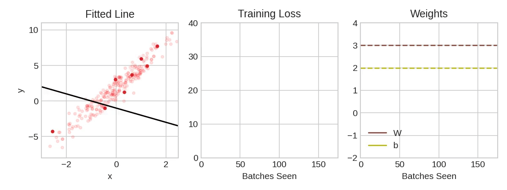
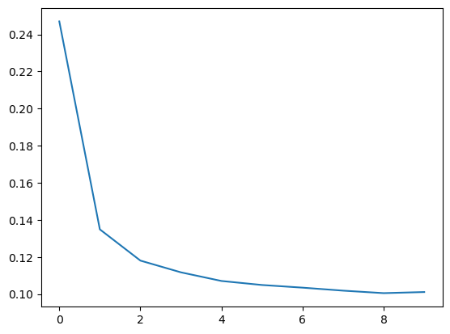

# 확률적 경사 하강법

> Keras와 TensorFlow를 사용하여 첫 번째 신경망을 학습해 보세요.

## 소개
지난 두 강의에서는 밀집층을 쌓아 완전 연결 신경망을 구축하는 방법을 배웠습니다. 신경망이 처음 생성될 때, 모든 가중치는 무작위로 설정됩니다. 즉, 신경망은 아직 아무것도 ‘알지’ 못합니다. 이번 강의에서는 신경망을 훈련시키는 방법, 즉 신경망이 어떻게 학습하는지 살펴보겠습니다.

모든 머신러닝 작업과 마찬가지로, 우리는 훈련 데이터 세트부터 시작합니다. 훈련 데이터의 각 예시는 몇 가지 특징(입력)과 예상되는 목표값(출력)으로 구성됩니다. 네트워크를 훈련한다는 것은 특징을 목표값으로 변환할 수 있도록 가중치를 조정하는 것을 의미합니다. 예를 들어, 80가지 시리얼 데이터셋의 경우, 각 시리얼의 ‘당분’, ‘식이섬유’, ‘단백질’ 함량을 입력으로 받아 해당 시리얼의 '칼로리'를 예측할 수 있는 네트워크를 원합니다. 네트워크를 성공적으로 훈련시켜 이 작업을 수행할 수 있다면, 그 가중치는 훈련 데이터에 표현된 대로 해당 특징들과 목표값 사이의 관계를 어떤 방식으로든 나타내야 합니다.

훈련 데이터 외에도 다음 두 가지가 더 필요합니다:

- 네트워크의 예측 정확도를 측정하는 “손실 함수”.
- 네트워크에 가중치를 어떻게 변경해야 하는지 알려주는 “최적화기”.

## 손실 함수
지금까지 네트워크 아키텍처를 설계하는 방법은 살펴보았지만, 네트워크가 어떤 문제를 해결해야 하는지 알려주는 방법은 다루지 않았습니다. 이것이 바로 손실 함수의 역할입니다.

손실 함수는 목표값의 실제 값과 모델이 예측한 값 사이의 차이를 측정합니다.

문제에 따라 필요한 손실 함수도 다릅니다. 지금까지 우리는 회귀 문제를 다루어 왔는데, 이는 특정 수치 값을 예측하는 작업입니다. 예를 들어 ‘80가지 시리얼의 칼로리'나 '레드 와인 품질 등급’ 등이 있습니다. 다른 회귀 작업으로는 주택 가격이나 자동차 연비 예측 등이 있습니다.

회귀 문제에서 흔히 사용되는 손실 함수는 **평균 절대 오차(MAE)** 입니다. 각 예측값 `y_pred`에 대해, MAE는 `abs(y_true - y_pred)`를 통해 실제 목표값 `y_true`와의 차이를 측정합니다.

데이터셋에 대한 총 MAE 손실은 이러한 모든 절대 차이의 평균입니다.


* 평균 절대 오차는 추정 곡선과 데이터 점 사이의 평균 거리입니다.

MAE 외에도 회귀 문제에서 흔히 사용되는 손실 함수로는 평균 제곱 오차(MSE)나 후버 손실(Huber loss)이 있습니다(두 가지 모두 Keras에서 사용할 수 있습니다).

훈련 과정에서 모델은 손실 함수를 지침으로 삼아 가중치의 올바른 값을 찾습니다(손실이 낮을수록 좋습니다). 다시 말해, 손실 함수는 신경망에게 그 목표를 알려주는 역할을 합니다.


## 최적화기 - 확률적 경사 하강법
네트워크가 해결해야 할 문제를 설명했으니, 이제 그 해결 방법을 정해야 합니다. 이것이 바로 최적화기의 역할입니다. 최적화기는 손실을 최소화하기 위해 가중치를 조정하는 알고리즘입니다.

딥러닝에서 사용되는 거의 모든 최적화 알고리즘은 확률적 경사 하강법이라는 범주에 속합니다. 이들은 단계적으로 네트워크를 훈련시키는 반복 알고리즘입니다. 훈련의 한 단계는 다음과 같이 진행됩니다:

1. 훈련 데이터를 일부 추출하여 네트워크에 입력해 예측을 수행합니다.
2. 예측값과 실제 값 사이의 손실을 측정합니다.
3. 마지막으로, 손실을 줄이는 방향으로 가중치를 조정합니다.

손실이 원하는 수준만큼 작아질 때까지(또는 더 이상 줄어들지 않을 때까지) 이 과정을 반복합니다.



* 확률적 경사 하강법을 이용한 신경망 학습.

각 반복에서 처리되는 훈련 데이터의 샘플을 미니배치(또는 흔히 그냥 “배치”)라고 하며, 훈련 데이터의 한 주기를 에포크라고 합니다. 훈련하는 에포크의 수는 네트워크가 각 훈련 예제를 몇 번이나 처리할지를 나타냅니다.

이 애니메이션은 SGD를 사용하여 제1강에서 다룬 선형 모델을 훈련하는 과정을 보여줍니다. 연한 빨간색 점들은 전체 훈련 집합을 나타내고, 굵은 빨간색 점들은 미니배치를 나타냅니다. SGD는 새로운 미니배치를 접할 때마다 가중치(w는 기울기, b는 y-절편)를 해당 배치의 올바른 값 쪽으로 조정합니다. 배치마다 반복되면서 직선은 결국 최적의 적합선에 수렴합니다. 가중치가 실제 값에 가까워질수록 손실값이 줄어드는 것을 확인할 수 있습니다.

## 학습률과 배치 크기
각 배치마다 선이 (끝까지 이동하는 대신) 방향만 약간씩 이동한다는 점에 주목하세요. 이러한 이동의 크기는 학습률에 의해 결정됩니다. 학습률이 작을수록 네트워크의 가중치가 최적의 값으로 수렴하기까지 더 많은 미니배치를 처리해야 합니다.

학습률과 미니배치의 크기는 SGD 훈련 진행 방식에 가장 큰 영향을 미치는 두 가지 매개변수입니다. 이 둘의 상호작용은 종종 미묘하며, 이 매개변수들에 대한 올바른 선택이 항상 명확한 것은 아닙니다. (연습 문제에서 이러한 효과를 살펴보겠습니다.)

다행히도 대부분의 작업에서는 만족스러운 결과를 얻기 위해 광범위한 하이퍼파라미터 탐색을 수행할 필요가 없습니다. Adam은 적응형 학습률을 가진 SGD 알고리즘으로, 별도의 파라미터 조정 없이도 대부분의 문제에 적합합니다(어떤 의미에서는 “자동 조정”되는 셈입니다). Adam은 훌륭한 범용 최적화기입니다.

## 손실 함수와 최적화기 추가
모델을 정의한 후에는 모델의 `compile` 메서드를 사용하여 손실 함수와 최적화기를 추가할 수 있습니다:

```
model.compile(
    optimizer="adam",
    loss="mae",
)
```

손실 함수와 최적화기를 단순한 문자열 하나로 지정할 수 있다는 점에 유의하세요. 예를 들어 매개변수를 조정하고 싶다면 Keras API를 통해 직접 접근할 수도 있지만, 우리 경우에는 기본값으로도 충분합니다.

### 이름에 담긴 의미는 무엇일까?
그라디언트는 가중치가 어떤 방향으로 이동해야 하는지를 알려주는 벡터입니다. 더 정확하게 말하면, 손실값이 가장 빠르게 변하도록 가중치를 어떻게 조정해야 하는지를 알려줍니다. 이 과정을 그라디언트 하강법이라고 부르는 이유는, 그라디언트를 사용하여 손실 곡선을 따라 최소값 쪽으로 내려가기 때문입니다. '스토카스틱(stochastic)'은 '우연에 의해 결정되는'이라는 뜻입니다. 미니배치는 데이터셋에서 무작위로 추출된 표본이므로, 우리의 훈련 과정은 스토카스틱합니다. 그래서 이 방법을 SGD라고 부르는 것입니다!


## 예시 - 레드 와인 품질
이제 딥러닝 모델 훈련을 시작하는 데 필요한 모든 것을 알게 되었습니다. 그럼 실제로 어떻게 작동하는지 살펴보겠습니다! ‘Red Wine Quality’ 데이터셋을 사용해 보겠습니다.

이 데이터셋은 약 1,600종의 포르투갈산 레드 와인에 대한 물리화학적 측정값으로 구성되어 있습니다. 또한 블라인드 테이스팅을 통해 각 와인에 부여된 품질 평가 점수도 포함되어 있습니다. 이러한 측정값을 바탕으로 와인의 주관적 품질을 얼마나 정확하게 예측할 수 있을까요?

다음 숨겨진 셀에 모든 데이터 전처리 과정을 담아 두었습니다. 이후 내용에 필수적인 부분은 아니므로 건너뛰셔도 무방합니다. 다만, 각 특징값을 [0,1] 구간 내에 오도록 재조정했다는 점은 주목해 주시기 바랍니다. 5강에서 더 자세히 다루겠지만, 신경망은 입력값이 공통된 척도에 있을 때 가장 우수한 성능을 보이는 경향이 있습니다.

``` python
import pandas as pd
from IPython.display import display

red_wine = pd.read_csv('../input/dl-course-data/red-wine.csv')

# Create training and validation splits
df_train = red_wine.sample(frac=0.7, random_state=0)
df_valid = red_wine.drop(df_train.index)
display(df_train.head(4))

# Scale to [0, 1]
max_ = df_train.max(axis=0)
min_ = df_train.min(axis=0)
df_train = (df_train - min_) / (max_ - min_)
df_valid = (df_valid - min_) / (max_ - min_)

# Split features and target
X_train = df_train.drop('quality', axis=1)
X_valid = df_valid.drop('quality', axis=1)
y_train = df_train['quality']
y_valid = df_valid['quality']
```
이 신경망에는 몇 개의 입력 변수가 필요할까요? 데이터 행렬의 열 수를 살펴보면 이를 알 수 있습니다. 이때 목표 변수(‘quality’)는 포함하지 말고, 오직 입력 특징만 포함해야 합니다.

```
print(X_train.shape)
```

```
(1119, 11)

```
열한 개의 열은 열한 개의 입력값을 의미합니다.

우리는 1,500개 이상의 뉴런을 가진 3층 신경망을 선택했습니다. 이 신경망은 데이터 내의 상당히 복잡한 관계를 학습할 수 있을 것으로 보입니다.

```python 
from tensorflow import keras
from tensorflow.keras import layers

model = keras.Sequential([
    layers.Dense(512, activation='relu', input_shape=[11]),
    layers.Dense(512, activation='relu'),
    layers.Dense(512, activation='relu'),
    layers.Dense(1),
])
```
모델 아키텍처를 결정하는 것은 일련의 과정의 일부여야 합니다. 간단하게 시작하고 검증 손실(validation loss)을 지침으로 삼으세요. 연습 문제를 통해 모델 개발에 대해 더 자세히 배우게 될 것입니다.

모델을 정의한 후에는 최적화기와 손실 함수를 통합합니다.

```python 
model.compile(
    optimizer='adam',
    loss='mae',
)
```

이제 훈련을 시작할 준비가 되었습니다! 아래 코드에서는 훈련 데이터를 256행씩(`batch_size`) 입력하고, 데이터셋 전체를 10번 반복(`epochs`)하도록 설정했습니다.

```python
history = model.fit(
    X_train, y_train,
    validation_data=(X_valid, y_valid),
    batch_size=256,
    epochs=10,
)
```

```
Epoch 1/10
5/5 [==============================] - 1s 66ms/step - loss: 0.2470 - val_loss: 0.1357
Epoch 2/10
5/5 [==============================] - 0s 21ms/step - loss: 0.1349 - val_loss: 0.1231
Epoch 3/10
5/5 [==============================] - 0s 23ms/step - loss: 0.1181 - val_loss: 0.1173
Epoch 4/10
5/5 [==============================] - 0s 21ms/step - loss: 0.1117 - val_loss: 0.1066
Epoch 5/10
5/5 [==============================] - 0s 22ms/step - loss: 0.1071 - val_loss: 0.1028
Epoch 6/10
5/5 [==============================] - 0s 20ms/step - loss: 0.1049 - val_loss: 0.1050
Epoch 7/10
5/5 [==============================] - 0s 20ms/step - loss: 0.1035 - val_loss: 0.1009
Epoch 8/10
5/5 [==============================] - 0s 20ms/step - loss: 0.1019 - val_loss: 0.1043
Epoch 9/10
5/5 [==============================] - 0s 19ms/step - loss: 0.1005 - val_loss: 0.1035
Epoch 10/10
5/5 [==============================] - 0s 20ms/step - loss: 0.1011 - val_loss: 0.0977
```

모델이 학습되는 동안 Keras가 손실 값을 지속적으로 업데이트해 준다는 것을 알 수 있습니다.

하지만 손실 값을 확인하는 더 좋은 방법은 그래프로 표시하는 것입니다. 사실 fit 메서드는 학습 과정에서 발생한 손실 값을 History 객체에 기록해 둡니다. 이 데이터를 Pandas 데이터프레임으로 변환하면 그래프 그리기가 훨씬 쉬워집니다.

```python
import pandas as pd

# convert the training history to a dataframe
history_df = pd.DataFrame(history.history)
# use Pandas native plot method
history_df['loss'].plot();
```


