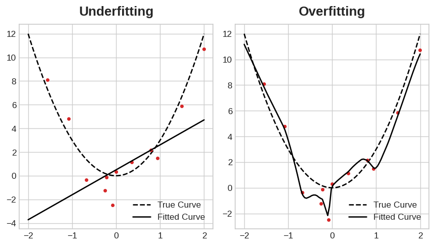
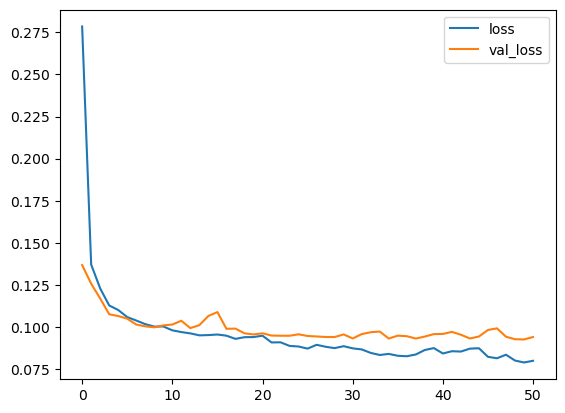

# 과적합과 미적합

## 소개
지난 강의의 예시에서 살펴본 바와 같이, Keras는 모델을 훈련하는 동안 에포크(epoch)별 훈련 및 검증 손실의 이력을 기록합니다. 이번 강의에서는 이러한 학습 곡선을 해석하는 방법과 이를 모델 개발의 지침으로 활용하는 방법을 배워보겠습니다. 특히, 학습 곡선을 분석하여 과소적합(underfitting)과 과적합(overfitting)의 징후를 파악하고, 이를 해결하기 위한 몇 가지 전략을 살펴보겠습니다.

## 학습 곡선 해석하기
훈련 데이터에 포함된 정보는 신호와 잡음, 두 가지로 나눌 수 있습니다. 신호는 일반화되는 부분으로, 모델이 새로운 데이터에 대해 예측을 내리는 데 도움이 되는 부분입니다. 노이즈는 훈련 데이터에만 해당되는 부분입니다. 노이즈는 실제 세계의 데이터에서 비롯된 모든 무작위 변동이나, 모델이 예측을 하는 데 실제로 도움이 되지 않는 모든 우연적이고 정보가 없는 패턴을 말합니다. 노이즈는 유용해 보일 수 있지만 실제로는 그렇지 않은 부분입니다.

우리는 훈련 세트에서 손실을 최소화하는 가중치나 매개변수를 선택하여 모델을 훈련시킵니다. 하지만 모델의 성능을 정확하게 평가하려면 새로운 데이터 세트, 즉 검증 데이터로 모델을 평가해야 한다는 사실을 알고 계실 것입니다. (복습을 원하시면 '머신러닝 입문'의 모델 검증 강의를 참고하시기 바랍니다.)

모델을 훈련할 때 우리는 훈련 데이터 세트의 손실 값을 에포크별로 그래프로 그려왔습니다. 여기에 검증 데이터의 그래프도 추가할 것입니다. 이러한 그래프를 ‘학습 곡선’이라고 부릅니다. 딥러닝 모델을 효과적으로 훈련하려면, 그 결과를 해석할 수 있어야 합니다.


* 검증 손실은 미관측 데이터에 대한 예상 오차를 추정해 줍니다.

이제, 모델이 신호를 학습하든 노이즈를 학습하든 훈련 손실(training loss)은 감소합니다. 하지만 검증 손실(validation loss)은 모델이 신호를 학습할 때만 감소합니다. (모델이 훈련 데이터 세트에서 학습한 노이즈는 새로운 데이터에 일반화되지 않기 때문입니다.) 따라서 모델이 신호를 학습하면 두 곡선 모두 감소하지만, 노이즈를 학습하면 곡선 사이에 차이가 생깁니다. 이 차이의 크기는 모델이 얼마나 많은 노이즈를 학습했는지를 알려줍니다.

이상적으로는 신호는 모두 학습하고 노이즈는 전혀 학습하지 않는 모델을 만들고 싶습니다. 하지만 이는 사실상 불가능합니다. 대신 우리는 타협을 선택합니다. 더 많은 노이즈를 학습하는 대가로 모델이 더 많은 신호를 학습하도록 할 수 있습니다. 이 타협이 우리에게 유리할 때만 검증 손실은 계속 감소합니다. 그러나 어느 시점이 지나면 타협이 우리에게 불리하게 돌아가고, 비용이 이득을 초과하게 되어 검증 손실이 증가하기 시작합니다.



이러한 상충 관계는 모델 훈련 시 두 가지 문제로 나타납니다. **과소적합(underfitting)** 은 모델이 신호를 충분히 학습하지 못해 손실값이 최대한 낮아지지 않는 경우이고, **과적합(overfitting)** 은 모델이 잡음을 너무 많이 학습하여 새로운 데이터에서의 성능이 떨어지는 경우입니다. 딥러닝 모델 훈련의 핵심은 이 둘 사이에서 최적의 균형을 찾는 데 있습니다.

이제 훈련 데이터에서 더 많은 신호를 추출하는 동시에 노이즈의 양을 줄이는 몇 가지 방법을 살펴보겠습니다.


## 용량
모델의 용량은 모델이 학습할 수 있는 패턴의 규모와 복잡성을 의미합니다. 신경망의 경우, 이는 주로 신경망이 가진 뉴런의 수와 뉴런들이 서로 어떻게 연결되어 있는지에 따라 결정됩니다. 네트워크가 데이터에 대해 과소적합(underfitting)되는 것으로 보인다면, 용량을 늘려보는 것이 좋습니다.

네트워크의 용량은 네트워크를 더 넓게(기존 레이어에 유닛을 추가) 만들거나 더 깊게(레이어를 추가) 만들어서 늘릴 수 있습니다. 더 넓은 네트워크는 선형적인 관계를 학습하기 쉬운 반면, 더 깊은 네트워크는 비선형적인 관계를 학습하는 데 더 적합합니다. 어느 쪽이 더 나은지는 데이터셋에 따라 달라집니다.

```python
model = keras.Sequential([
    layers.Dense(16, activation='relu'),
    layers.Dense(1),
])

wider = keras.Sequential([
    layers.Dense(32, activation='relu'),
    layers.Dense(1),
])

deeper = keras.Sequential([
    layers.Dense(16, activation='relu'),
    layers.Dense(16, activation='relu'),
    layers.Dense(1),
])
```
이 실습을 통해 네트워크 용량이 성능에 어떤 영향을 미치는지 살펴보게 될 것입니다.


## 조기 종료

앞서 모델이 노이즈를 지나치게 학습할 경우, 훈련 도중 검증 손실이 증가하기 시작할 수 있다고 언급한 바 있습니다. 이를 방지하기 위해, 검증 손실이 더 이상 감소하지 않는 시점에 훈련을 중단할 수 있습니다. 이를 **조기 종료(early stopping)** 라고 합니다.


* 검증 손실이 최소가 되는 모델을 선택합니다.


검증 손실이 다시 상승하기 시작하는 것을 감지하면, 가중치를 최소값이 나타났던 시점으로 되돌릴 수 있습니다. 이를 통해 모델이 계속해서 잡음을 학습하거나 데이터에 과적합되는 것을 방지할 수 있습니다.

조기 종료를 활용하면 네트워크가 신호 학습을 완료하기 전에 훈련이 너무 일찍 중단되는 위험도 줄어듭니다. 즉, 과적합뿐만 아니라 과소적합도 함께 방지할 수 있습니다. 에포크 수를 충분히 크게 설정해 두면, 나머지는 조기 종료가 알아서 처리해 줍니다.

## 조기 종료 기능 추가
Keras에서는 콜백을 통해 훈련 과정에 조기 종료 기능을 포함시킵니다. 콜백이란 네트워크가 훈련되는 동안 주기적으로 실행되도록 지정하는 함수를 말합니다. 조기 종료 콜백은 매 에포크가 끝날 때마다 실행됩니다. (Keras에는 미리 정의된 유용한 콜백이 다양하게 제공되지만, 직접 콜백을 정의할 수도 있습니다.)

```python
from tensorflow.keras.callbacks import EarlyStopping

early_stopping = EarlyStopping(
    min_delta=0.001, # minimium amount of change to count as an improvement
    patience=20, # how many epochs to wait before stopping
    restore_best_weights=True,
)
```

이 매개변수들은 “지난 20 에포크 동안 검증 손실이 최소 0.001만큼 개선되지 않았다면, 훈련을 중단하고 지금까지 찾은 최상의 모델을 유지하라”는 의미입니다. 검증 손실이 과적합 때문인지, 아니면 단순히 배치 간의 무작위 변동 때문인지 판단하기 어려운 경우가 있습니다. 이 매개변수들을 통해 훈련을 중단할 시점에 대해 어느 정도 유연성을 부여할 수 있습니다.

이 콜백을 `fit` 메서드에 전달하면 훈련 중 자동으로 실행됩니다.

## 예시 - 조기 종료 기능을 적용하여 모델 훈련하기
지난 튜토리얼의 예시를 바탕으로 모델 개발을 계속해 보겠습니다. 해당 네트워크의 용량을 늘리는 동시에, 과적합을 방지하기 위해 조기 종료 콜백을 추가할 것입니다.

다음은 데이터 전처리 과정입니다.

```python
import pandas as pd
from IPython.display import display

red_wine = pd.read_csv('../input/dl-course-data/red-wine.csv')

# Create training and validation splits
df_train = red_wine.sample(frac=0.7, random_state=0)
df_valid = red_wine.drop(df_train.index)
display(df_train.head(4))

# Scale to [0, 1]
max_ = df_train.max(axis=0)
min_ = df_train.min(axis=0)
df_train = (df_train - min_) / (max_ - min_)
df_valid = (df_valid - min_) / (max_ - min_)

# Split features and target
X_train = df_train.drop('quality', axis=1)
X_valid = df_valid.drop('quality', axis=1)
y_train = df_train['quality']
y_valid = df_valid['quality']
```

이제 네트워크의 용량을 늘려보겠습니다. 상당히 큰 규모의 네트워크를 구성하되, 검증 손실이 증가하는 조짐이 보이면 콜백을 통해 훈련을 중단하도록 하겠습니다.

```python
from tensorflow import keras
from tensorflow.keras import layers, callbacks

early_stopping = callbacks.EarlyStopping(
    min_delta=0.001, # minimium amount of change to count as an improvement
    patience=20, # how many epochs to wait before stopping
    restore_best_weights=True,
)

model = keras.Sequential([
    layers.Dense(512, activation='relu', input_shape=[11]),
    layers.Dense(512, activation='relu'),
    layers.Dense(512, activation='relu'),
    layers.Dense(1),
])
model.compile(
    optimizer='adam',
    loss='mae',
)
```

콜백을 정의한 후, fit 함수의 인자로 추가하세요(여러 개를 지정할 수 있으므로 리스트로 묶어 넣으세요). 조기 종료(early stopping)를 사용할 때는 필요한 것보다 더 많은 에포크 수를 설정하세요.

```python
history = model.fit(
    X_train, y_train,
    validation_data=(X_valid, y_valid),
    batch_size=256,
    epochs=500,
    callbacks=[early_stopping], # put your callbacks in a list
    verbose=0,  # turn off training log
)

history_df = pd.DataFrame(history.history)
history_df.loc[:, ['loss', 'val_loss']].plot();
print("Minimum validation loss: {}".format(history_df['val_loss'].min()))
```
최소 검증 손실: 0.09269220381975174



과연, Keras는 500 에포크가 다 끝나기도 훨씬 전에 훈련을 중단해 버렸습니다!


