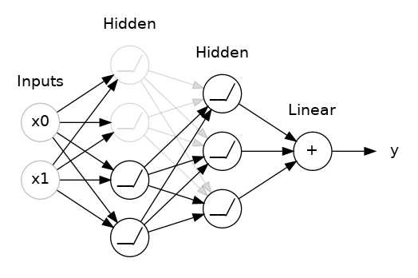
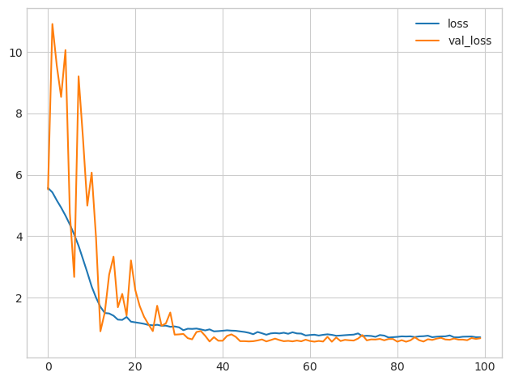

# 드롭아웃과 배치 정규화

과적합을 방지하고 훈련을 안정화하기 위해 이러한 특수 레이어를 추가하세요.

## 소개
딥러닝의 세계는 단순히 밀집 레이어(dense layer)만으로 이루어진 것이 아닙니다. 모델에 추가할 수 있는 레이어의 종류는 수십 가지에 달합니다. (Keras 문서를 살펴보며 예시를 확인해 보세요!) 일부는 밀집 레이어와 유사하여 뉴런 간의 연결을 정의하고, 다른 일부는 전처리나 다양한 형태의 변환을 수행할 수 있습니다.

이번 강의에서는 자체적으로 뉴런을 포함하지는 않지만, 모델에 다양한 이점을 줄 수 있는 기능을 추가하는 두 가지 특수한 레이어에 대해 알아보겠습니다. 이 두 가지 레이어는 모두 현대적인 아키텍처에서 흔히 사용됩니다.

## 드롭아웃
첫 번째는 “드롭아웃 레이어”로, 과적합을 교정하는 데 도움이 될 수 있습니다.

지난 강의에서 우리는 과적합이 네트워크가 훈련 데이터의 허위 패턴을 학습함으로써 발생한다는 점을 다루었습니다. 이러한 허위 패턴을 인식하기 위해 네트워크는 종종 매우 특정한 가중치 조합, 즉 일종의 “가중치 공모”에 의존합니다. 너무 특정한 탓에 이들은 취약한 경향이 있습니다. 하나만 제거해도 그 공모는 무너져 버립니다.

이것이 바로 드롭아웃의 원리입니다. 이러한 '공모'를 깨기 위해, 훈련의 각 단계마다 레이어의 입력 유닛 중 일부를 무작위로 제거함으로써, 네트워크가 훈련 데이터의 허위 패턴을 학습하기 훨씬 어렵게 만듭니다. 대신 네트워크는 가중치 패턴이 더 견고한, 광범위하고 일반적인 패턴을 찾아야만 합니다.



여기서는 두 숨겨진 층 사이에 50% 드롭아웃이 추가되었습니다.

드롭아웃을 일종의 네트워크 앙상블을 구성하는 과정으로 생각해 볼 수도 있습니다. 예측은 더 이상 하나의 거대한 네트워크가 아닌, 여러 개의 작은 네트워크로 구성된 ‘위원회’에 의해 이루어집니다. 위원회 내의 개별 네트워크들은 서로 다른 종류의 오류를 범하는 경향이 있지만, 동시에 정답을 맞히는 경우도 있어, 위원회 전체의 성능이 개별 네트워크보다 더 우수해집니다. (의사결정 나무의 앙상블인 랜덤 포레스트에 익숙하다면, 이는 동일한 개념입니다.)

## 드롭아웃 추가하기
Keras에서 드롭아웃 비율(rate) 인수는 입력 유닛 중 몇 퍼센트를 비활성화할지 정의합니다. 드롭아웃을 적용하려는 레이어 바로 앞에 드롭아웃 레이어를 배치하세요:

```
keras.Sequential([
    # ...
    layers.Dropout(rate=0.3), # apply 30% dropout to the next layer
    layers.Dense(16),
    # ...
])
```
## 배치 정규화
다음으로 살펴볼 특수 레이어는 **배치 정규화(batch normalization, batchnorm)** 입니다. 느리거나 불안정한 훈련 과정을 개선하는 데 도움이 됩니다.

신경망의 경우, 일반적으로 scikit-learn의 StandardScaler나 MinMaxScaler와 같은 도구를 사용하여 모든 데이터를 공통된 척도로 변환하는 것이 좋습니다. 그 이유는 SGD가 데이터가 생성하는 활성화 값의 크기에 비례하여 네트워크 가중치를 이동시키기 때문입니다. 활성화 값의 크기가 매우 다른 특징들은 훈련 과정을 불안정하게 만들 수 있습니다.

그렇다면, 데이터가 네트워크로 들어가기 전에 정규화하는 것이 좋다면, 네트워크 내부에서도 정규화하는 것이 더 나을지도 모릅니다! 사실, 이를 수행할 수 있는 특별한 종류의 레이어인 배치 정규화(batch normalization) 레이어가 있습니다. 배치 정규화 레이어는 들어오는 각 배치 데이터를 먼저 해당 배치의 평균과 표준편차로 정규화한 다음, 두 개의 학습 가능한 재스케일링 매개변수를 사용하여 데이터를 새로운 척도로 변환합니다. 즉, 배치 정규화는 입력 데이터에 대해 일종의 조율된 재스케일링을 수행하는 것입니다.

대부분의 경우, 배치 정규화는 최적화 과정을 돕기 위해 추가됩니다(때로는 예측 성능 향상에 도움이 되기도 합니다). 배치 정규화를 적용한 모델은 훈련을 완료하는 데 필요한 에포크 수가 더 적은 경향이 있습니다. 게다가 배치 정규화는 훈련이 “정체”되는 원인이 되는 다양한 문제들을 해결할 수도 있습니다. 특히 훈련 중에 문제가 발생한다면, 모델에 배치 정규화를 추가하는 것을 고려해 보십시오.

## 배치 정규화 추가하기
배치 정규화는 네트워크의 거의 모든 지점에서 사용할 수 있는 것으로 보입니다. 특정 레이어 뒤에 배치할 수 있습니다...

```
layers.Dense(16, activation='relu'),
layers.BatchNormalization(),
```

... 또는 층과 그 활성화 함수 사이에서:

```
layers.Dense(16),
layers.BatchNormalization(),
layers.Activation(‘relu’),
```
또한 이를 네트워크의 첫 번째 레이어로 추가하면, Sci-Kit Learn의 StandardScaler와 같은 역할을 하는 일종의 적응형 전처리기로 기능할 수 있습니다.


## 예시 - 드롭아웃과 배치 정규화 활용
레드 와인 모델 개발을 계속해 보겠습니다. 이제 모델의 용량을 더욱 늘리되, 과적합을 방지하기 위해 드롭아웃을 적용하고, 최적화 속도를 높이기 위해 배치 정규화를 추가하겠습니다. 또한 이번에는 데이터 정규화 과정을 생략하여, 배치 정규화가 훈련 과정을 어떻게 안정화시키는지 보여드리겠습니다.

```python
# Setup plotting
import matplotlib.pyplot as plt

plt.style.use('seaborn-whitegrid')
# Set Matplotlib defaults
plt.rc('figure', autolayout=True)
plt.rc('axes', labelweight='bold', labelsize='large',
       titleweight='bold', titlesize=18, titlepad=10)


import pandas as pd
red_wine = pd.read_csv('../input/dl-course-data/red-wine.csv')

# Create training and validation splits
df_train = red_wine.sample(frac=0.7, random_state=0)
df_valid = red_wine.drop(df_train.index)

# Split features and target
X_train = df_train.drop('quality', axis=1)
X_valid = df_valid.drop('quality', axis=1)
y_train = df_train['quality']
y_valid = df_valid['quality']
```
드롭아웃을 적용할 때는 덴스 레이어의 유닛 수를 늘려야 할 수도 있습니다.

```python
from tensorflow import keras
from tensorflow.keras import layers

model = keras.Sequential([
    layers.Dense(1024, activation='relu', input_shape=[11]),
    layers.Dropout(0.3),
    layers.BatchNormalization(),
    layers.Dense(1024, activation='relu'),
    layers.Dropout(0.3),
    layers.BatchNormalization(),
    layers.Dense(1024, activation='relu'),
    layers.Dropout(0.3),
    layers.BatchNormalization(),
    layers.Dense(1),
])
```
훈련 방식은 이전과 동일합니다.

```python
model.compile(
    optimizer='adam',
    loss='mae',
)

history = model.fit(
    X_train, y_train,
    validation_data=(X_valid, y_valid),
    batch_size=256,
    epochs=100,
    verbose=0,
)


# Show the learning curves
history_df = pd.DataFrame(history.history)
history_df.loc[:, ['loss', 'val_loss']].plot();
```



일반적으로 데이터를 훈련에 활용하기 전에 정규화하면 더 나은 성능을 얻을 수 있습니다. 하지만 원시 데이터 그대로를 사용할 수 있었다는 사실은, 처리하기 까다로운 데이터셋에서 배치 정규화가 얼마나 효과적인지 보여줍니다.

이제 드롭아웃(dropout) 기법을 활용해 Spotify 데이터셋에 대한 예측 정확도를 높여보고, 배치 정규화(batch normalization)가 처리하기 까다로운 데이터셋에 어떻게 도움이 되는지 확인해 봅시다.


